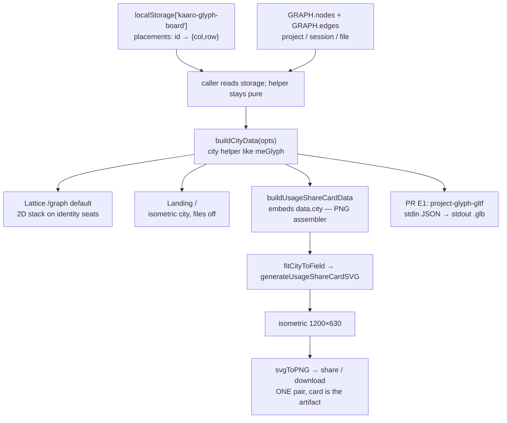
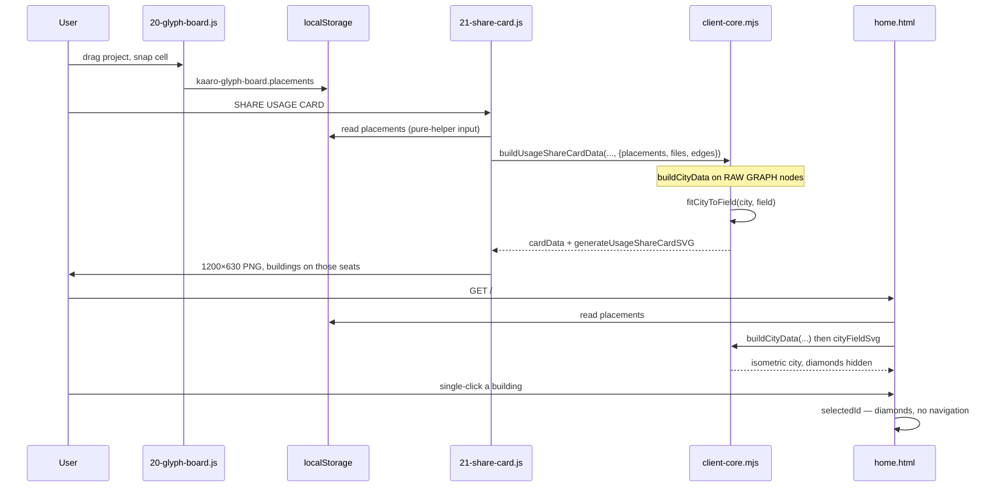

# RFC: Project City — buildings on user seats

**Project:** kaaroSessions
**Status:** Proposed — do not implement from this document until a stacked PR is opened. **Do not open PR A until Appendix G (geometry) is treated as the source of truth** — field fit, `cellR`/`hexR`/`dy`, and isometric faces are functions with numeric fixtures, not sketches.
**Date:** 2026-08-31
**Author:** kaaroSessions
**Relates to:** [RFC-share-cards.md](./RFC-share-cards.md) (one assembler / one renderer / card-is-the-artifact) · [RFC-me-share-card.md](./RFC-me-share-card.md) (truthful encoding, `forceSolid`, epithet, ME in the right column) · [RFC-project-glyphs.md](./RFC-project-glyphs.md) (hex primitive, `sizeNorm` = consumption) · [RFC-project-glyph-grid.md](./RFC-project-glyph-grid.md) (lattice seats, `kaaro-glyph-board`, idle-hollow as live-dock grammar) · Register A (`experience/design-tokens.mjs`, `SHARE_CARD_TOKENS`) · `docs/GRAPH-PERFORMANCE-REQUIREMENT.md` (force is forensic)
**Grounding:** live `sessions-data.json` → `buildGraph` → `graph-data.json` on the authoring machine, 2026-08-31. Snapshot `meta.generated_at` = `2026-08-30T19:04:18.522Z` — **census drifts** as JSONL lands; **§6 is a snapshot, not a success assertion**. Re-verified by reading `experience/graph-pipeline.mjs`, `experience/graph-data.mjs`, `experience/client-core.mjs`, `experience/client/20-glyph-board.js`, `experience/client/21-share-card.js`, `hooks/session-reducer.mjs`, `experience/pages/home.html`.

Copy-verbatim destination in the repo: [`RFC-project-city.md`](./RFC-project-city.md).

---

# Part I — Vision

## 1. Knowledge fragment

A stranger — or future-you, six months cold — looking at the still should be able to say:

> **these are the worlds, where I placed them, who touched them, how many runs, how fat the work was, what we actually edited.**

The epithet ([RFC-me-share-card.md](./RFC-me-share-card.md)) names the person. The city names the worlds.

That is the whole product question this RFC answers. Everything else is geometry.

## 2. The city metaphor

A project is not a planet with moons. A project is a **plot**.

You already chose the plots. Lattice mode (`LAYOUT_HANDLERS.grid`, `experience/client/20-glyph-board.js`) is the cadastral map: drag a hex, snap to a cell, persist `{ col, row }` in `localStorage['kaaro-glyph-board']`. Those seats are the only spatial memory the user has ever been allowed to write. The city is that map, built.

| City word | Data |
|---|---|
| Seat | `placements[projectId] = { col, row }` — user-authored, or `mergeGlyphPlacements` radial default |
| Footprint | `sizeNorm` — how fat the work was (consumption; `tool_calls` if tokenless) |
| Height / slabs | `session_count` — how many runs; oldest at the base, newest at the roof |
| Facade mix | weighted harness wedges in the footprint (who touched it, in proportion) |
| Roof ring | `recencyLevel` — which worlds are still warm |
| Ground diamonds | **working set** — files actually Read/Write/Edited, not the inventory a `Glob` could list |
| Short name | `humanizeProjectLabel` on the heaviest plots only |

A building is a stack of days on a plot you picked. That is more true than a ball.

## 3. Why balls / the double-spiral die

The Full Usage Canvas ([RFC-share-cards.md](./RFC-share-cards.md) v3, patched by [RFC-me-share-card.md](./RFC-me-share-card.md)) layers two independent spirals that share a centre:

1. Session **balls**, `_fillRadius` + `glyphSpiralCell(i)`, radius = `tool_diversity`.
2. Project **hexes**, a second `_fillRadius` + `glyphSpiralCell(i)`, radius = `sizeNorm`.

`generateUsageShareCardSVG` in `experience/client-core.mjs` does this today. **Landing and share-card callers** pass no `placements` into `projectGlyphFieldSvg` / `buildUsageShareCardData`. The functions themselves already accept placements (`projectGlyphFieldSvg` → `mergeGlyphPlacements`; the dock already forwards `st.placements`). The PNG and the landing mint a second, author-free geography because **the callers ignore the board**.

That is the bug, named:

- **Seats are a user document.** `mergeGlyphPlacements` / `glyphGraphPins` / `moveGlyphPlacement` already treat them as one.
- **Balls encode the wrong atom.** Session count is intelligence; a 200-cap mosaic of `tool_diversity` disks is texture that fights the hexes. Height on the building *is* the session count, without a second mark family.
- **Two spirals cannot dock.** Exact hex↔ball correspondence was already rejected ([RFC-share-cards.md](./RFC-share-cards.md) §5). Replacing balls with slabs on the hex they belong to is the correspondence we refused to fake.
- **Do not size both axes by session count.** A 17-run `kaaroSessions` (7.1M tokens) is not the same mass as a 21-run `kaaroViewer` (57.8M). Footprint = volume. Height = runs. Orthogonal, or the city lies.

The double-spiral was a good answer to “show both counts on one still.” The city is a better one: one mark, two axes, on the seats you already chose.

## 4. Why landing is a city, not a force graph

Force `/graph` is a forensic instrument. `docs/GRAPH-PERFORMANCE-REQUIREMENT.md` measured the cost on an earlier dump (~718 nodes, ~585 files, ~1150 edges). This snapshot is **556 nodes / 962 edges** (23 project · 108 session · 9 cluster · 1 subagent · **415 file**). The cost has not changed character:

1. `d3.forceManyBody` + `forceCollide` on hundreds of nodes.
2. Default-on file diamonds (`#cb-files` and `#cb-ro-files` both `checked` today, `minSessions = 1`). **v1 turns `#cb-files` off by default** (working-set diamonds are opt-in). `#cb-ro-files` stays as today but is inert while files are off.
3. Infinite CSS `.pring` on anything warmer than 15 minutes.
4. SSE `updated` → `window.updateGraph` → join + sim restart.

A stranger does not need 415 file diamonds and 108 orbiting disks to read “these are my worlds.” They need the cadastral map at rest.

- **`/` (landing)** becomes the city: buildings on seats, files off until a building is selected, ME hero above (unchanged grammar). Optimized surface. Zero d3-force.
- **`/graph` default is Lattice** (human reviewer, 2026-08-31): history opens on buildings on your seats. Force remains a layout button (`#force` / the Force control). Session satellites stay until they get in the way. **`#cb-files` is off by default** — working-set diamonds are opt-in; the checkbox is not auto-toggled when switching layouts.
- **Do not** make `d3-force` extrude buildings. Extrusion is SVG (share / landing / lattice) or a GLB souvenir (PR **E1**, no app hook). ForceGraph3D swapping spheres for towers is a later **E2**, not v1.

The city is not a prettier graph. It is the view that does not need the graph.

## 5. Why GLTF is a collectible, not a page dependency

Imagine produces images. A building is a mesh.

The app must render with **zero assets**: `hexPath` + stacked parallelograms + projected wedges, the same way it already paints glyphs. No runtime `npm` in kaaroSessions (the package has none today; `package.json` `"files"` does not even ship `node_modules`). CDN D3 / 3d-force-graph stay where they are; they are not this.

A separate skill (`project-glyph-gltf`) takes **one building payload** and writes a `.glb` — a procedural hex prism, not an Imagine picture, not a page fetch. If the file is missing, SVG/canvas still works. The share card never mentions GLB. Experience never imports `hooks/`. The mesh is a souvenir of a world, like the PNG is a souvenir of a census. **The app does not `fetch` `~/.kaaro/…` from the browser** (no such serve route; none will be added for this).

---

# Part II — Spec

## 6. Live grounding (authoring machine, 2026-08-31 snapshot)

From `sessions-data.json` → `buildGraph` (`experience/graph-pipeline.mjs`) → `graph-data.json`. **Snapshot, not an assertion. Do not `assert.equal(sessions.length, 108)` in tests.**

| Field | Snapshot value |
|---|---|
| Sessions | **108** |
| Projects | **23** |
| Tokens | 147,144,024 (`fmtTok` → `147.1M`) |
| Tool calls | 5,218 |
| Date range | 2025-03-01 → 2026-08-30 |
| Graph nodes | **556** (23 project · 108 session · 9 cluster · 1 subagent · 415 file) |
| Graph edges | **962** |
| Membership edges | **117 = 108 session→project + 9 cluster→project.** `buildGraph` pushes `type:'membership'` once per session (line 149) **and** once per cluster to its project (line 236). Clusters also get `bundle` edges (23). Not a contradiction. |
| Other edges (this dump) | write 235 · edit 146 · read 341 · branch 99 · bundle 23 · spawn 1 |
| Rollup files | 415 (`write+edit` 276 · read-only 139) |
| ME wedges (`meGlyph` session-count) | pi 51 (47%) · command-code 24 (22%) · grok 22 (20%) · claude-code 5 · copilot 5 · codex 1 |
| Harness tokens | pi 102.1M · claude-code 42.1M · grok 2.81M · codex 0.17M · command-code **0** · copilot **0** |
| Project recencyLevel | 19 at 0 · 3 at 1 · 1 at 3 |
| Session `file_ops` on GRAPH nodes | **absent** (graph-pipeline does not copy it) |
| Caps to think against | 60 projects / 200 sessions (share-card constants, un-eyeballed) |

**Worlds that lock the encoding:**

| Project (humanized) | Sessions | Harness mix | tokens_total | tokens_work | sizeNorm | recency | Why it matters |
|---|---|---|---|---|---|---|---|
| `kaaroViewer` | 21 | pi 21 | 57.8M | 1.23M | ~1.00 | 0 | Heaviest footprint; tallest stack (cap 12, `+9`) |
| `alfred-buildathon` | 5 | claude-code 5 | 42.1M | 1.51M | ~0.85 | 0 | Fat, short — orthogonal axes; `tokens_work` would *outrank* Viewer |
| `kaaroBrain` | 11 | **pi 10 + grok 1** | 16.6M | 0.13M | ~0.54 | 0 | Equal wedges would lie (50/50); weighted = 91/9 |
| `kaaroSessions` | 17 | pi 8 + grok 9 | 7.08M | 0.12M | ~0.35 | **3** | Live roof; mixed facade; cap 12, `+5` |
| `kaaro-sessions` (CC) | 11 | command-code 11 | **0** | 0 | tool_calls fallback (687) | 0 | Tokenless twin — must still get diamonds if it has write+edit |
| 3× `subagent-01a053…` | 6+4+2 | grok | 0.64M / 0.44M / 0.23M | 0 | small | **1** | Grok worktree ids; data smell, in the city until identity is fixed |

Working-set vs inventory, same dump: kaaroBrain has **82** write/edit files across 10 Pi sessions; kaaroViewer **76** across 21. The city shows **≤6** diamonds per plot. Native `project_id` rows with zero working-set files exist (empty chats + several tokenless CC worlds) — representative set, not a bug. Tests use factories, not this census.

Stress vs live: 23 / 108 fits; 60 / 200 must still tessellate (`cellR` / `dy` / `fitCityToField`, Appendix G).

## 7. Goals & Non-goals

**Goals (v1, PRs A–D; E1 optional; E2 later):**

1. **One city payload**, pure, Node-tested: `buildCityData` (a helper like `meGlyph`, not a second PNG assembler). Four surfaces consume it. No second geography.
2. **Placements in.** Share card and landing **callers** read `kaaro-glyph-board` the same way Lattice does. Missing → `mergeGlyphPlacements` radial default. Ids sorted `id` asc inside the helper so callers cannot desync.
3. **Buildings, not balls.** Usage-card left field loses session circles. Height = sessions (capped). Footprint = existing `sizeNorm` via `hexRFromCellR`.
4. **Weighted footprint wedges** by session count per harness. `harnessWedges` already accepts `weights`; city uses `harnessWedgePts` projected through `isoProject`.
5. **Working-set diamonds**, capped, from GRAPH file nodes + file edges (`e.weight || 1`). Not `list_dir` / `Glob` / `Grep`. Legend stops saying “files” as if complete.
6. **Landing `/` is the city at rest.** Files off until select. **`/graph` defaults to Lattice.** Force is a layout, not the landing of history. `#cb-files` **off by default**.
7. **SVG/canvas with zero assets.** GLTF is skill **E1** (stdin JSON → stdout GLB). No browser fetch of meshes.

**Non-goals (do not reopen, do not sneak in):**

- Merging Grok worktree ids or Command Code `users-*` twins into canonical projects (identity RFC; city will show them).
- Promoting `list_dir` / `Glob` / `Grep` into `file_ops` / graph file nodes (needs a new op + a cap, later RFC).
- Sizing **both** footprint and height by `session_count`.
- Retargeting footprint to `tokens_work` in v1 (payload carries it; no control).
- Auto-hiding `#cb-files` when switching Lattice ↔ Force (the control stays where the user put it after load; only the **initial** HTML is unchecked).
- Putting ME back in the field (v1 lesson, RFC-share-cards v2→v3).
- Changing idle-hollow on the live dock / Force graph. City buildings are solid (`forceSolid` already exists).
- Fabricated public URL; second assembler for the PNG; `experience/` importing `hooks/`; runtime npm; Imagine-as-mesh.
- d3-force extrusion; WebGL on `/` or the share card.
- Calling 2D `scaleGlyphPins` then `isoProject` (overflows the field). One function: `fitCityToField`.
- jsdom tests for `21-share-card.js` / `20-glyph-board.js` / `home.html` (documented coverage gap). Browser smoke is on each PR checklist.
- Feature-flag infra (none exists).
- Syncing placements across devices.
- `projectGlyphMarkup({ weights })` in PR A (city draws through `cityBuildingMarkup`; live dock stays equal-angle).
- Exporting `CONSTELLATION_MAX_PROJECTS` (file-private today). Share/landing slice uses **exported** `CITY_SHARE_MAX_PROJECTS = 60` (tests import it; do not re-export the mosaic const).
- Browser reading `~/.kaaro/glyphs/`. No serve route.

## 8. Proposed design

### 8.1 One payload, four surfaces



Force `/graph` (default) is unchanged in v1 except legend copy (PR D). No 3D layout hook in v1 (E2 later).

### 8.2 Why a new helper (`buildCityData`), not a fork of the usage card

[RFC-share-cards.md](./RFC-share-cards.md) §2: one assembler + one renderer **per artifact kind**. The PNG is still the usage card. Preview / share / download still call `buildUsageShareCardData` + `generateUsageShareCardSVG`.

`buildCityData` is **not** a second assembler for that PNG. It is the city helper the way `meGlyph` is the ME helper. Do not add `generateCityShareCardSVG`.

| Consumer | Calls |
|---|---|
| Usage card assembler | `data.city = buildCityData(...)` on **raw** `opts.projects` / `opts.sessions` **before** the constellation map, then the same renderer |
| Lattice | `buildCityData` directly |
| Landing | `buildCityData` directly |
| GLTF skill E1 | one `buildings[]` element as JSON |

Extending `buildUsageShareCardData` *instead* would drag epithet / months / ME census into Lattice and the skill. Rejected.

`buildUsageShareCardData` keeps being the usage-card assembler. It gains `opts.placements` / `opts.files` / `opts.edges` and stores `city`. It **stops** ranking projects into a spiral for the field (spiral remains only as the `mergeGlyphPlacements` default when no seats exist).

### 8.3 Sequence



## 9. Assembler contract

Pure. Lives in `experience/client-core.mjs` (no import graph; injected as `%%CLIENT_CORE%%`). Node-tested in `test/client-core.test.mjs`. Does not read `localStorage`. Does not import `hooks/`.

### 9.1 `buildCityData(opts)`

```
buildCityData({
  projects,          // RAW GRAPH project nodes (type:'project')
  sessions,          // RAW GRAPH session nodes (type:'session') — no file_ops on them
  files,             // GRAPH file nodes   (type:'file')    — optional, default []
  edges,             // GRAPH.edges — membership + write/edit/read
  placements,        // { [projectId]: { col, row } } | null
  slabCap,           // default CITY_SLAB_CAP (12)
  topFilesCap,       // default CITY_TOP_FILES (6)
  labelCount,        // default CITY_LABEL_COUNT (5)
} = {})
```

There is **no `maxProjects` cap inside the helper.** `buildings[]` is one entry per input project. Share/landing slice at draw time (`CITY_SHARE_MAX_PROJECTS = 60`, **exported**). Do not export `CONSTELLATION_MAX_PROJECTS`. Lattice uses the full array.

**Does:**

1. `ids = [...projects].map(p => p.id).sort((a, b) => (a < b ? -1 : a > b ? 1 : 0))` — **same as** `20-glyph-board.js` `projectList()` (`id` asc). Independent of caller order and of label-rank.
2. `merged = mergeGlyphPlacements(ids, placements)` — saved cells win; leftovers take `firstAvailableRadial` in **this id-asc order**. Duplicate cell in `saved` skipped (existing rule).
3. For each project (input set, not sorted-by-tokens), attach `col`/`row` from `merged` and compute weights, slabs, topFiles, shortLabel.
4. Sort a **label rank** by `tokens_total` desc (tie-break `session_count` desc, then `id`) — **not** a layout sort; used only for `labeledIds` and for share/landing draw order / overflow caption.
5. `labeledIds` = first `labelCount` of that rank (intersect all building ids).
6. `diamondIds` = ids of buildings with `topFiles.length > 0` (write+edit working set), **not** the tokens_total label set.

**Return shape:**

```
{
  kind: 'city',
  placements: { [id]: { col, row } },   // merged, every project id
  buildings:  CityBuilding[],           // EVERY input project, stable id-asc
  labeledIds: string[],                 // top labelCount by tokens_total
  diamondIds: string[],                 // buildings with a working set
}
```

No phantom `allIds`. Overflow for the PNG is `Math.max(0, buildings.length - CITY_SHARE_MAX_PROJECTS)` computed by the renderer, not the helper.

**`CityBuilding`:**

```
{
  id:             string,                      // canonical project id
  label:          string,                      // raw GRAPH label (kept for tests)
  shortLabel:     string,                      // humanizeProjectLabel(label)
  color:          string,                      // project colour (PALETTE)
  harnesses:      string[],                    // project.harnesses order, as GRAPH has it
  weights:        { [harness]: number },       // session counts; missing harness → 0
  sizeNorm:       number,                      // passthrough GRAPH project.sizeNorm
  footprint:      number,                      // === sizeNorm (named for readers)
  session_count:  number,
  tokens_total:   number,
  tokens_work:    number,                      // carried; NOT the v1 scale
  tool_calls:     number,                      // sum of member session.tool_calls || 0
  recencyLevel:   number,                      // passthrough
  last_activity:  string | null,
  inFlight:       boolean,                     // !!p.inFlight (projects are false today)
  col:            number,
  row:            number,
  slabs:          { harness, color, date_str, ts }[],  // oldest → newest, FULL list
  overflowSlabs:  number,                      // max(0, slabs.length - slabCap)
  topFiles:       { path, name, write, edit, read, color }[],  // cap topFilesCap
}
```

`color` on a slab is `HARNESS_MARK[harness] || building.color`. `color` on a file is the GRAPH file node's `color` (`EXT_COLORS`) or `#666666` — used on **Lattice / landing only**. PNG diamonds fill `building.color` (or `--k-geo`); they do not encode `EXT_COLORS` (§16).

`name` is `fileBaseName(path)`: replace `\\` with `/`, last non-empty segment. Full `path` is on the payload for Lattice/landing titles; the PNG renderer must not interpolate it.

### 9.2 Weights

```
weights[s.harness || s.source] += 1
```

over RAW session nodes with `project_id === building.id`. Do **not** equal-split `project.harnesses`. On this dump `kaaroBrain` is `pi: 10, grok: 1`.

`projectGlyphMarkup` today calls `harnessWedges(d.harnesses, r)` with no weights. **PR A does not change that.** City drawing goes through `cityBuildingMarkup` → `harnessWedgePts(..., weights)` (Appendix G). Live Force / dock stay equal-angle.

### 9.3 Slabs

Member sessions sorted by `(first_timestamp || last_activity || '')` ascending — **oldest at the base, newest at the roof.**

`slabs[]` is the full list (one entry per session). The renderer (and `citySlabSlice`) caps:

```
CITY_SLAB_CAP = 12

function citySlabSlice(slabs, cap = CITY_SLAB_CAP) {
  if (slabs.length <= cap) return { shown: slabs, overflow: 0, seam: false };
  const shown = slabs.slice(0, cap - 1).concat(slabs[slabs.length - 1]);
  return { shown, overflow: slabs.length - cap, seam: true };
}
```

On this dump: `kaaroViewer` 21 → 11 oldest + newest + `+9` and a seam; `kaaroSessions` 17 → `+5`; `kaaroBrain` 11 → no cap. Stress 200 sessions on one project still renders 12 slabs.

Empty project (should not happen): `slabs = []`, draw the footprint hex only.

### 9.4 Footprint axis — `cellR` vs `hexR` vs `dy`

**Lock: footprint = existing project `sizeNorm`.**

From `experience/graph-pipeline.mjs`:

```
consumption(p) = p.tokens_total > 0 ? p.tokens_total : (p.tool_calls || 0)
sizeNorm       = √(consumption / MAX_CONSUMPTION)
```

Session disks use the same consumption definition (G6). `tokens_work` stays on the node for panels/timeline — not the disk scale and not the city footprint. Tokenless-only buildings already have non-zero `sizeNorm` via `tool_calls`. Do not special-case them.

**Three named lengths. Do not call them all `pitch`.**

| Name | Meaning | Formula |
|---|---|---|
| `cellR` | lattice cell radius (the hex the *seat* occupies) | Lattice identity: `GLYPH_GRAPH_R` = `NODE_RADII.PR_MAX * 2` = **68**. Share card: pre-fit 68, post-fit `pins` scale (Appendix G.4). |
| `dx`, `dy` | neighbour steps | `glyphCellPitch(cellR)` → `dx = cellR * √3`, `dy = cellR * 1.5`. At 68: `dx ≈ 117.8`, **`dy = 102`**. |
| `hexR` | building footprint radius (the *mark*) | `hexRFromCellR(cellR, sizeNorm)` below. **Always ≤ 0.55 · cellR.** |

```
CITY_HEX_R_MIN_FRAC = 0.42
CITY_HEX_R_MAX_FRAC = 0.55   // was 0.82 — that overlapping odd-row roofs; see below

function clamp(n, lo, hi) { return Math.max(lo, Math.min(hi, n)); }

function hexRFromCellR(cellR, sizeNorm) {
  const n = sizeNorm || 0;
  const span = CITY_HEX_R_MAX_FRAC - CITY_HEX_R_MIN_FRAC; // 0.13
  return clamp(cellR * (CITY_HEX_R_MIN_FRAC + span * n),
               cellR * CITY_HEX_R_MIN_FRAC,
               cellR * CITY_HEX_R_MAX_FRAC);
}
```

Zero-`sizeNorm` still gets the 0.42 band (empty-home plots remain a seat). `sizeNorm = 1` hits 0.55·cellR (37.4px at 68), not 0.82 (55.8px). Dynamic range is tighter; 23 plots still read as a city. Shrinking **stack** instead would pancake 12 slabs (~7px) — rejected.

**Stack locks to `dy`, not to `hexR`:**

```
CITY_SLAB_CAP        = 12
CITY_COLLISION_FRAC  = 0.50     // max stack = 50% of ROW pitch dy
CITY_SLAB_H_MAX      = 6        // px, binds only when dy is generous

function citySlabMetrics(dy, cap = CITY_SLAB_CAP) {
  const stack = Math.min(dy * CITY_COLLISION_FRAC, cap * CITY_SLAB_H_MAX);
  const slabH = stack / cap;
  return { slabH, stack };
}
```

Lattice: `dy = 102` → `stack = 51`, `slabH = 4.25`. `hexR` max = `0.55 * 68 = 37.4` **inside** the cell.

The two inequalities `hexR ≤ 0.55·cellR` and `stack ≤ 0.50·dy` do **not** by themselves prevent a roof from sitting inside a neighbour hex. Odd-r neighbour of `(0,0)` is `(dx/2, −dy) ≈ (58.9, −102)`. Roof centre is `(0, −stack) = (0, −51)`. Distance ≈ **77.9**. At the old 0.82 frac, `2·hexR = 111.5` — overlap of ~34px (the 12-slab roof enters the neighbour plot). Same-row footprints were already fine (`dx ≈ 117.8`).

**v1 constant fix (not a written-accept of overlap):**

```
function roofNeighbourClearance(cellR) {
  const { dx, dy } = glyphCellPitch(cellR);
  const { stack } = citySlabMetrics(dy);
  const hexR = hexRFromCellR(cellR, 1);
  const dist = Math.hypot(dx / 2, dy - stack); // (0,−stack) → (dx/2, −dy)
  return { dist, twoR: 2 * hexR, ok: dist >= 2 * hexR };
}
```

At `cellR = 68`, `f = 0.50`, `hexR_max = 0.55·cellR`: `dist ≈ 77.9`, `2·hexR = 74.8`, gap ≈ 3px. `roofNeighbourClearance(68).ok === true` is a PR A test. `fitCityToField` scales uniformly, so the inequality survives onto the PNG. PR B is not a surprise: roofs stay inside their plot at max height and max footprint.

**Lattice vs city footprint encoding: one formula.** Lattice `cityBuildingMarkup` uses `r: hexRFromCellR(GLYPH_GRAPH_R, d.sizeNorm)`, **not** `nodeRadius(d)` (18–34). Force keeps `nodeRadius` on the flat hex so the forensic graph is unchanged. The city is a different mark; encoding continuity across Lattice / landing / share wins over Force morph continuity of radius.

Sparse n=2 on the **card**: `fitCityToField` max-clamps post-fit `cellR` to `CITY_FIT_CELL_R_MAX = 36` so two adjacent seats do not grow 200px hexes and walk through the divider. Landing uses viewBox (no divider); CSS max-height letterboxes.

### 9.5 Working set — full `workingSetForProject`

GRAPH session nodes **do not carry `file_ops`**. `buildFileNodesAndEdges` already folded `sess.file_ops` at analyze time using only `FILE_OP_TOOLS` in `hooks/session-reducer.mjs`. `list_dir`, `Glob`, `Grep`, `grep_search` are not in that map. Experience must not import `hooks/`.

```
const FILE_EDGE_TYPES = new Set(['write', 'edit', 'read']);

function fileBaseName(path) {
  const s = String(path || '').replace(/\\/g, '/');
  const parts = s.split('/').filter(Boolean);
  return parts.pop() || s;
}

function workingSetForProject(projectId, { sessions = [], files = [], edges = [], cap = 6 } = {}) {
  const memberIds = new Set(
    sessions.filter(s => s.project_id === projectId).map(s => s.id)
  );
  const acc = new Map();
  for (const e of edges) {
    if (!FILE_EDGE_TYPES.has(e.type)) continue;
    const src = e.source?.id ?? e.source;
    const tgt = e.target?.id ?? e.target;
    if (!memberIds.has(src)) continue;
    if (!acc.has(tgt)) acc.set(tgt, { path: tgt, write: 0, edit: 0, read: 0 });
    acc.get(tgt)[e.type] += (e.weight || 1);
  }
  const fileById = new Map(files.map(f => [f.id, f]));
  return [...acc.values()]
    .filter(f => (f.write + f.edit) > 0)
    .sort((a, b) => {
      const dw = (b.write + b.edit) - (a.write + a.edit);
      if (dw) return dw;
      if (b.read !== a.read) return b.read - a.read;
      return a.path < b.path ? -1 : a.path > b.path ? 1 : 0;
    })
    .slice(0, cap)
    .map(f => {
      const node = fileById.get(f.path);
      return {
        path: f.path,
        name: node?.label || fileBaseName(f.path),
        write: f.write, edit: f.edit, read: f.read,
        color: node?.color || '#666666',
      };
    });
}
```

Cap 6 = one diamond per hex vertex. **Vertex assignment:** `hexVertices(hexR)[k]` at radius `CITY_DIAMOND_OUT * hexR` (`CITY_DIAMOND_OUT = 1.15`), `k = 0 … topFiles.length-1`, vertex 0 = pointy top. **Size:** `maxWe = Math.max(1, ...topFiles.map(f => f.write + f.edit))` among the **capped** list; diamond half-diagonal `d = clamp(3 + 5 * √((write+edit)/maxWe), 3, 8)` on the card, `(4, 11)` on lattice.

Tests must pin `e.weight` (10 vs 1, not edge counts) and `fileBaseName('C:\\foo\\bar.mjs') === 'bar.mjs'`.

### 9.6 `buildUsageShareCardData` — call the helper on RAW GRAPH nodes

Today’s assembler maps projects down to `{id,label,color,harnesses,recencyLevel,inFlight,sizeNorm,session_count,tokens_total}` and sessions to `{color, diversity}` **before** anything else. If `buildCityData` ran on those objects, `tokens_work`, `first_timestamp`, `harness`/`source`, `project_id`, `tool_calls`, `date_str` would be gone.

**Locked call, before the constellation map:**

```
export function buildUsageShareCardData(me, opts = {}) {
  const rawProjects = opts.projects || [];
  const rawSessions = opts.sessions || [];
  const city = buildCityData({
    projects: rawProjects,
    sessions: rawSessions,
    files: opts.files || [],
    edges: opts.edges || [],
    placements: opts.placements || null,
  });
  // THEN the existing census map (diversity balls, months, epithet, …)
  const projects = rawProjects.slice().sort(…).map(p => ({ id, label, color, … }));
  const sessions = rawSessions.slice().sort(…).map(s => ({ color, diversity }));
  …
  return { …existing census fields, city };
}
```

Do **not** pass the diversity-ball array into `buildCityData`. `data.sessions` may remain `{ color, diversity }[]` so census tests keep compiling until PR A deletes ball painting; `generateUsageShareCardSVG` must not paint them.

Caller in `experience/client/21-share-card.js` (`#me-share-btn`). Sort is belt-and-suspenders — the helper sorts ids itself:

```
let saved = null;
try { saved = JSON.parse(localStorage.getItem('kaaro-glyph-board') || '{}').placements; } catch {}
const projects = GRAPH.nodes.filter(n => n.type === 'project');
const sessions = GRAPH.nodes.filter(n => n.type === 'session');
const files    = GRAPH.nodes.filter(n => n.type === 'file');
const cardData = buildUsageShareCardData(meGlyph(sessions), {
  projectCount, tokensTotal, dateFrom, dateTo,
  projects, sessions, files, edges: GRAPH.edges, placements: saved,
  displayName,
});
```

Missing / malformed storage → `placements: null` → radial default, same as Lattice’s first visit.

Test: a session `{ harness:'pi', project_id, first_timestamp, tool_calls }` still produces slabs/weights after `buildUsageShareCardData`.

## 10. Surfaces (cameras)

Zero WebGL. Zero images. Register A: no shadows, no gradients, no `radius > 2px`, no blue chrome. Flat fills. IBM Plex Mono. `esc()` every user string.

Lattice shares a canvas with session satellites and `d3.zoom`. A true isometric camera would shear those satellites. Share card and landing have no satellites.

| Surface | Camera | Placement |
|---|---|---|
| Lattice `/graph` (default) | 2D stack: slabs offset in **screen −Y** | identity `glyphGraphPins`, `cellR = GLYPH_GRAPH_R` |
| Landing `/` | 2.5D isometric via `isoProject` | `cityFieldSvg` viewBox = iso AABB + pad |
| Share card field | 2.5D isometric | **`fitCityToField` only** — never `scaleGlyphPins` then iso |
| 3D layout | out of v1 (E2 later) | — |

`iso: false` is not a different encoding — same slabs, same cap, same wedges, same diamonds — just unsheared.

Constructible geometry, `fitCityToField`, face indices, wedge projection, and numeric fixtures: **Appendix G**. That appendix is what makes PR A implementable; §10 here only names the cameras.

### 10.4 Recency roof ring

City buildings are **always solid**. Recency is a ring on the roof, not a hollow hex. **Live graph stays as-is** (`04-rendering.js`: level 1 `stroke-opacity .2`; level 2/3 `.pring` `--po` 0.45 / 0.75). City roof uses **those same literals**, not 0.25 / 0.55 / 0.85:

| recencyLevel | Roof (city markup) |
|---|---|
| 0 | no ring |
| 1 | static hairline, project colour, `stroke-opacity=".2"` |
| 2 | 1.5px `--k-geo` (`#00ff88`), opacity 0.45 |
| 3 | 2px `--k-geo`, opacity 0.75 |
| inFlight | additional `--k-select` hairline (projects do not set `inFlight` today) |

Share card / landing: **no** `.pring` animation. Lattice **may** put `class="pring"` on the roof path for level ≥ 2, paused on `prefers-reduced-motion` / `html.k-hidden` as today.

### 10.5 Labels

`humanizeProjectLabel(label)` already exists. Draw `shortLabel` (`_shareTrunc(..., 14)` on the card, 18 on landing) **only** for `labeledIds` (top `CITY_LABEL_COUNT = 5` by `tokens_total`). Every building gets `<title>` with the short label.

Tests that ban `Users-` must target **visible `<text>`**, not `data-pid` (canonical ids on this dump still contain `Users-`).

### 10.6 Markup entry points

```
cityBuildingMarkup(building, {
  r,            // hexR (footprint), required
  slabH,
  iso = false,
  showDiamonds = true,
  diamondFill,  // PNG: building.color; local: file.color
  label = false,
  bg = '#000000',
} = {}) → string   // inner SVG, local coords; no <svg> wrapper

cityFieldSvg(city, {
  iso = true,
  showDiamonds = false,
  selectedId = null,
  bg = '#000000',
  pad = 16,
  cellR = GLYPH_GRAPH_R,
} = {}) → string   // full <svg viewBox="…">
```

`cityFieldSvg` (landing / tests): lattice cartesian at `cellR`, `isoProject` extents, viewBox = AABB + `pad` (must include roof `z`, labels, diamonds). No `fitCityToField` (no fixed pixel frame). CSS sizes the SVG.

Landing click: `showDiamonds` false globally, true for `selectedId`. Lattice uses per-node `cityBuildingMarkup`, not `cityFieldSvg`.

Path count snapshot (iso, no diamonds, no ring, nShown slabs, 1 harness): `1` roof wedge-set + `3 * nShown` side faces + `1` roof outline. No `<rect rx>`, no `filter=`.

## 11. Surfaces (product)

### 11.1 Lattice (`/graph` grid layout)

**Files:** `experience/client/04-rendering.js` (`renderNodeContent`), `experience/client/20-glyph-board.js` (minimap stays flat).

`renderNodeContent` is d3 `append`, not HTML. Recency rings are drawn **before** the project hex today. `cityBuildingMarkup` already includes the roof ring.

When `currentLayout === 'grid'` and `d.type === 'project'`:

1. **Skip** the existing recency-circle block for that node (level-1 hairline and `.pring`). City markup owns the roof; drawing both double-rings.
2. `const cellR = GLYPH_GRAPH_R;` `const { dx, dy } = glyphCellPitch(cellR);` `const { slabH } = citySlabMetrics(dy);` `const hexR = hexRFromCellR(cellR, d.sizeNorm);`
3. Look up `building` from a `buildCityData` result cached on the board (same GRAPH + placements as `boardState`).
4. Inject a nested group: `el.append('g').attr('class','city').html(cityBuildingMarkup(building, { iso: false, r: hexR, slabH, showDiamonds: true, diamondFill: 'file', label: labeledIds.includes(d.id) }))`.
5. Optional: roof path `class="pring"` for `recencyLevel >= 2`.

Force branch (`currentLayout === 'force'`): unchanged hex + `nodeRadius(d)` + existing recency circles.

**Default layout is Lattice.** `let currentLayout = 'grid'` in `04-rendering.js`. Boot: no hash → Lattice; `#grid` → Lattice; **`#force` → Force**. `20-glyph-board.js` today only auto-opens on `#grid` — invert: open Lattice unless hash is `#force` (or another non-grid layout). Landing **OPEN LATTICE** → `/graph` (already Lattice).

Seats stay `glyphGraphPins` (identity). Drag-snap / swap unchanged. Session satellites remain in v1. **`#cb-files` off by default** (`template.html`: drop `checked`). Do not auto-toggle it on layout change. Dock minimap (`projectGlyphFieldSvg` at `MINI_R = 7`, already passes `placements`) **stays idle-hollow glyphs** — it does not go through `renderNodeContent`. Do not draw 12-slab buildings at r=7.

2D markup tests live in **PR A**, not only B, so the primitive exists before canvas glue.

### 11.2 Landing `/` (PR C is an IA change)

**Files:** `experience/pages/home.html`. Routing is already correct (`surface/http-routes.mjs`: `/` and `/home` → `home.html`; `/graph` → graph).

Today `#glyph-field` is **secondary, `hidden` until boot, below the three tiles**, `r: 14`, no placements. Click on `[data-pid]` **navigates to `/graph#grid`**.

**DOM after PR C** (`#main` column, Register A, no new chrome):

```
#boot
#me-hero                 ← unchanged; click still → /graph
#glyph-field             ← HERO city, unhidden with tiles after boot
  .hd                    ← "N live · N projects" (existing copy)
  #glyph-field-body      ← cityFieldSvg(...)
  button.open-lattice    ← "OPEN LATTICE" → /graph (Lattice is default; `#force` is Force)
#tiles                   ← graph / now / daw
#contrib
```

CSS: `#glyph-field { width: min(640px, 92vw); }` SVG `width:100%; height:auto; max-height: min(42vh, 420px)`. Remove `hidden` default-below-tiles; keep boot gate (`dataset.ready` + `chromeLive`) so the handshake still runs.

**`cityFieldSvg` args (landing):**

```
cityFieldSvg(city, {
  iso: true,
  showDiamonds: false,
  selectedId,          // null or project id
  bg: KAARO_TOKENS.bg,
  pad: 16,
  cellR: GLYPH_GRAPH_R,
})
```

viewBox includes stack + labels + diamond radius. Fetch already returns `/graph-data.json` with `nodes` + `edges`.

**Click contract:**

| Gesture | Result |
|---|---|
| Single-click `[data-pid]` | `preventDefault` / `stopPropagation`. `selectedId = pid`. Re-render with diamonds + short label for that plot only. **Do not navigate.** |
| Single-click empty city / ME (ME keeps today’s `/graph`) | city: `selectedId = null`. ME: `/graph`. |
| Double-click `[data-pid]` or `OPEN LATTICE` | `location.href = '/graph'` (Lattice default). Force is `/graph#force`. |
| `g` / `n` / `d` / `m` | unchanged |

Pass into `buildCityData`: `projects` (helper sorts id-asc), `sessions`, `files`, `edges`, `placements` from `kaaro-glyph-board`. Files off until select = no diamonds until `selectedId`. Zero d3-force.

### 11.3 ME share card field

**Files:** `experience/client-core.mjs` (`generateUsageShareCardSVG`), `experience/client/21-share-card.js`.

Geometry `_shareGeom()` **unchanged**: 1200×630, dividerX 660, field `(55, 100) → (630, 514)`, ME at `(1020.4, 320)` r=56, stats at rightPad 700, `legendY0 = 412`, epithet footer.

**Left field replaces balls + spiral hexes** with the isometric city:

1. `city = data.city` (if missing, draw nothing in the field — do not revive balls).
2. `shown = city.buildings` in label-rank order, sliced to `CITY_SHARE_MAX_PROJECTS`. Overflow caption `+N projects`.
3. **`fit = fitCityToField(city, { x0:55, y0:100, x1:630, y1:514, shownIds })`** — Appendix G.4. **Do not call `scaleGlyphPins`.**
4. Paint `shown` back-to-front by `isoProject(cx,cy,0).y` then `id` (not `col+row`). Each group `transform="translate(pin.x, pin.y)"` + `cityBuildingMarkup({ iso:true, r: fit.hexRById[id], slabH: fit.slabH, showDiamonds: city.diamondIds.includes(id), diamondFill: 'building', label: city.labeledIds.includes(id) })`.
5. Diamonds: **unlabeled**, fill `building.color`, on every building in `diamondIds` that is also painted (working set, including tokenless CC). Name labels stay `labeledIds` (tokens_total top 5).
6. Pulse strip stays. Caption y as today.

**Exact caption** (no letter-spacing):

```
◆ footprint = consumption · height = sessions · diamonds = working set
```

Worked width at 5.4 px/glyph: 62 chars ≈ 335px. Plus ` · +99 projects more` ≈ 462px < 575.

AABB test (PR A, blocks merge): every `buildingIsoExtents` point mapped through the fit transform (`cxF + (p − centroid)*s`) stays inside `x∈[55,630], y∈[100,514]`. Fixtures: n=2 adjacent seats; n=60 packed spiral; empty `buildings` returns empty pins (no `Math.min(...[])`).

Right column unchanged. `MOSAIC_MAX_SESSIONS` unused by this renderer; leave until nothing else references it.

### 11.4 3D layout

`experience/client/10-3d.js` stays spheres in v1. **No GLB loader, no `~/.kaaro` path, no `localStorage` mesh map.** PR E1 does not touch this file. E2 (later RFC) would name `nodeThreeObject` and a user-supplied `Blob` URL — out of this document’s implementation PRs.

### 11.5 Legend + captions (PR D)

Today (`experience/pages/template.html` `#legend`):

```
Project cluster
Session (size = AI work)     ← already a lie: G6 sized sessions by tokens_total
File (size = edits)
```

Boot line (`00-boot.js`): `N projects · N sessions · N files`.

Landing graph tile: `Sessions, projects, files — what was worked on, laid out in time.`

**Working set vs inventory, named on-surface:**

| Copy | v1 text |
|---|---|
| Legend file row | `Working set (write+edit) — not a full tree` |
| Legend session row | `Session (size = consumption)` |
| Legend project row | `Project hex / city footprint = consumption · height = sessions` |
| `#cb-files` | Label `Working-set nodes`. **HTML: no `checked`** (off by default). `#cb-ro-files` stays `checked` but is inert while files are off. |
| Boot L2 | `N projects · N sessions · N working-set files` |
| Landing tile desc | `Sessions and projects, laid out in time. Force graph is forensic.` |
| Share caption | §11.3 |

`#cb-ro-files` stays “Read-only files.”

## 12. GLTF skill boundary — E1 only

**Skill name:** `project-glyph-gltf`

**PR E1 (this RFC):** stdin JSON → stdout GLB. **No app changes. No `10-3d.js`. Title must not mention `/graph` 3D.**

**Input:** one `CityBuilding` JSON (stdin or `--in building.json`).

**Output:** GLB 2.0 on stdout or `--out`. Procedural hex prism:

- Little-endian header: magic `0x46546C67` (`glTF`), version `2`, byte length.
- JSON chunk type `0x4E4F534A`, then BIN chunk `0x004E4942`, each **4-byte padded** (JSON with spaces, BIN with `0x00`).
- glTF defaults: **Y-up**, CCW winding, +Z forward.
- Unit hex × `hexRFromCellR(1, sizeNorm)`; height `nShown * (1/12)` in the same units (`citySlabSlice`).
- One mesh; **`nShown` primitives** — **each slab is a closed hex prism** (6 walls + top cap + bottom cap), harness colour as `pbrMetallicRoughness.baseColorFactor`, metal 0, rough 1. No textures, no Imagine, no network, no path strings in extras.
- Topology (lock; put this comment in the E1 test file):
  ```
  // closed hex prism per slab:
  //   6 walls × 2 tris + 2 caps × 4 tris (n-2 fan) = 20
  //   primitives = nShown
  //   triangles  = nShown * 20
  ```
  Do **not** use the outer-shell formula `nShown*12+8` (that is one wall stack + a single top and bottom — it disagrees with one primitive per coloured slab).
- Normals: per-face, indexed; golden test does not hash vertices.

**Golden:** `{ sizeNorm: 1, session_count: 3, slabs: 3× grok, overflowSlabs: 0 }` → `nShown = 3` → header version 2, JSON+BIN chunks, **3 primitives, 60 triangles**. Assert those two integers.

**Code:** `scripts/project-glyph-gltf.mjs`. Zero new `package.json` dependencies. May import `hexRFromCellR` / `citySlabSlice` from `experience/client-core.mjs`. Must not import `hooks/`.

**Not in E1:** `GLTFLoader`, `nodeThreeObject`, `fetch('/glyphs/…')`, `~/.kaaro`, `localStorage` paths, CDN meshes. Share / landing / lattice never depend on GLB.

## 13. Tests

TDD, `node:test` + `node:assert/strict`, fixtures as inline factories. Primary file: `test/client-core.test.mjs`. No jsdom. **Browser smoke is on the PR checklist**, not a wish. Do not assert live census integers.

**`buildCityData`**

1. Saved placement `{ a: { col: 2, row: 1 } }` wins; `b` gets first empty radial **in id-asc**.
2. Unsorted input `[z, a, m]` + `placements: null` → same seats as `mergeGlyphPlacements(['a','m','z'], null)` (helper sorts; callers cannot desync from Lattice `projectList`).
3. `buildings.length === projects.length` even at 61 projects; no cap inside the helper.
4. Footprint `sizeNorm` passthrough; a 21-session / small-token project is **not** taller in `sizeNorm` than a 5-session / huge-token project.
5. `tokens_work` present and unused by `footprint`.
6. Tokenless project keeps GRAPH `sizeNorm`.
7. `kaaroBrain`-shaped 10 pi + 1 grok → `weights.pi === 10`, `weights.grok === 1`. `harnessWedgePts(..., weights)` span ≠ equal-angle control (lock: weighted grok wedge angle is `2π/11`, not `π`).
8. Slabs oldest→newest.
9. 21 slabs, cap 12 → shown 12, overflow 9, seam true, `shown[0]` oldest, `shown[11]` newest.
10. Assembler does not read `localStorage`.

**`workingSetForProject`**

11. `acc[type] += e.weight || 1`. Two-project over-credit: same path, project A edge `weight:10`, project B `weight:1` → A’s `write===10`, B’s `write===1`.
12. D3-mutated `{ source:{id}, target:{id} }` still counts.
13. Drops read-only; cap 6; sort stable.
14. `fileBaseName('C:\\foo\\bar.mjs') === 'bar.mjs'`.
15. `maxWe` among capped `topFiles`.
16. `Glob`/`list_dir` cannot appear (fixture only has write/edit/read edges).

**`buildUsageShareCardData` forwarding**

17. Pass raw sessions `{ harness:'pi', project_id:'p', first_timestamp, tool_calls:3 }` + matching project → `data.city.buildings[0].weights.pi === 1` and `slabs[0].harness === 'pi'`. Diversity map must not be the city input.

**Geometry (Appendix G) — PR A, block merge**

18. `isoProject(1,0,0)` ≈ `{ x: √3/2, y: 0.5 }`; `isoProject(0,0,1) = { x:0, y:-1 }` (atol 1e-9).
19. `isoProject(0,1,0)` ≈ `{ x: -√3/2, y: 0.5 }`.
20. Worked `sideFace` for vertex pair **`[1,2]`** (E wall — not necessarily `CITY_VISIBLE_FACES[0]`), r=20, slabH=4, z0=0, z1=4: quad ≈ `(23.660, 3.660), (6.340, 13.660), (6.340, 9.660), (23.660, -0.340)` (3 dp).
20b. `CITY_VISIBLE_FACES` centroid iso `y` is **non-decreasing**: for `r=20`, `zMid=2`, `faceCentroidIsoY(pair)` on `[[3,4],[1,2],[2,3]]` is sorted ascending (SW farthest, SE nearest).
21. `hexRFromCellR(68, 1) === 0.55*68`; `hexRFromCellR(68, 0) === 0.42*68`.
22. `citySlabMetrics(102)` → `stack <= 51`; `citySlabMetrics(16)` → `stack <= 8` (no clamp-to-2px). `roofNeighbourClearance(68).ok === true` (`dist >= 2 * hexRFromCellR(68, 1)`).
23. `fitCityToField` AABB: n=2 adjacent `{col:0,row:0},{col:1,row:0}`, both `sizeNorm=1`, 12 slabs, diamonds on, **labeled** — map **every** `buildingIsoExtents` point through `cxF + (p.x − cxA)*s`, `cyF + (p.y − cyA)*s` and assert the set ⊂ `[55,630]×[100,514]`. n=60 radial seats, same. n=2 `hexRById` ≤ `0.55 * CITY_FIT_CELL_R_MAX`. Empty `buildings` → `{ pins:{}, hexRById:{}, s:1, slabH:0 }` (no `Infinity`).
24. `cityBuildingMarkup({iso:true})` : no `<rect`, no `filter=`, no `rx=`; side-face path count `3 * nShown`; first painted face of a slab is SW (`[3,4]`).
25. `cityBuildingMarkup({iso:false})` : slab groups translated `(0, -i*slabH)` (PR A, not only B).
26. Paint order: buildings with equal `col+row` but different `iso y` are **not** tied; sort key is `isoProject(cx,cy,0).y` then `id`.
27. `cityFieldSvg` viewBox includes roof `z` (height of viewBox > footprint-only AABB).
28. Usage SVG: no ball signature `opacity="0.65"` circles; caption strings; idle project still paints `HARNESS_MARK`; visible `<text>` has no `/Users-/i`; ME at `(1020.4, 320)`; `WEDGES = SESSIONS`; caption `length * 5.4 < 575` with `+99 projects more`; seats ≠ `glyphSpiralCell` tokens-desc; **no file basenames / full paths**. Diamond `fill` equals `building.color` on a fixture whose **project colour is not `#00cccc`** and whose `topFiles[0].color` **is** `#00cccc` (`PALETTE[6]` is `#00cccc` — do not ban that hex globally).

**Regression:** `forceSolid` dock tests, `humanizeProjectLabel` table, epithet, `applyDisplayName`, session/project cards. `test/design-lint.test.mjs` still clean. New city exports are `export function` / `export const`. `stripExports` already strips `export async function` (`build.mjs`); do not add a new async export here (`svgToPNG` already exists).

**Browser smoke (PR checklist):** `/graph` → Lattice, drag a project, SHARE USAGE CARD, that building sits on the same relative seat; `/` city at rest, single-click shows ≤6 diamonds and does not navigate; Force still hexes + files.

## 14. API / interface changes

No HTTP API change. No `sessions-data.json` schema change.

New exports from `experience/client-core.mjs`:

```
buildCityData
workingSetForProject
fileBaseName
citySlabSlice
citySlabMetrics
hexRFromCellR
fitCityToField
cityBuildingMarkup
cityFieldSvg
isoProject
isoHexPts
CITY_SLAB_CAP
CITY_TOP_FILES
CITY_LABEL_COUNT
CITY_COLLISION_FRAC
CITY_FIT_CELL_R_MAX
CITY_FIELD_MARGIN
CITY_VISIBLE_FACES
CITY_DIAMOND_OUT
CITY_SHARE_MAX_PROJECTS
CITY_HEX_R_MIN_FRAC
CITY_HEX_R_MAX_FRAC
CITY_LABEL_HALF_W
```

`hexVertices` / `pathFromPts` / `harnessWedgePts` stay **file-private** in `client-core.mjs` (same file as `hexPath`). Tests go through `isoProject` / `isoHexPts` / markup strings / `CITY_VISIBLE_FACES`, not `hexVertices`. **Export `CITY_SHARE_MAX_PROJECTS`.** Do not export `CONSTELLATION_MAX_PROJECTS`. Do not export `scaleGlyphPins` changes — **leave it alone**; city does not call it. Optionally export `roofNeighbourClearance` (or test it via the public `hexRFromCellR` + `citySlabMetrics` + `glyphCellPitch`).

## 15. Data model changes

None in analyze. City is a view of GRAPH + user seats.

**Migration:** `kaaro-glyph-board` shape unchanged. No version key.

**Identity leftovers** (CC twins, Grok worktrees) appear as extra buildings. Out of scope.

## 16. Security & privacy

The share card **leaves the machine as a PNG**. Landing and Lattice do not.

**Do not encode on the PNG:**

- Full file paths, home directories, `file_ops` keys
- Working-set **basenames**
- `EXT_COLORS` (mjs/js/ts/…) — a stranger would read “this world edits TypeScript.” PNG diamonds = `building.color` (or `--k-geo` if you need contrast; pick `building.color`). Lattice/landing keep EXT_COLORS on titled marks.
- `first_user_message`, `ai_title`, git branches, prompts
- Raw `Users-<user>-…` **visible text**
- Display name unless the user typed it

**Do encode on the PNG:** relative seats, consumption footprint, session height, harness mix, recency ring, humanized heaviest names, epithet / counts / date range.

**Landing / Lattice:** basenames in `<title>` / selected diamonds are origin-local. Still `esc()`.

**XSS:** `esc()` on every user string in SVG text. `_shareFooter` remains the single footer escape point.

**localStorage:** origin-scoped. `serve.mjs` never reads it.

**GLB (E1):** no path strings in extras. No browser I/O.

## 17. Observability

No server metric.

- Tests: `node --test test/client-core.test.mjs` (and design-lint).
- Browser smoke per PR (§13).
- Negative: Force graph still hexes; dock minimap still idle-hollow; session/project share cards unchanged.
- Do not log placements, displayName, or file paths to `GET /status`.
- Performance: landing city is ≤60 painted buildings × (1 footprint + 12×3 faces + 6 diamonds) ≈ **3k paths** worst case (61st+ exist on the payload but are not painted on share/landing). No simulation. REQ-GRAPH-PERF-01 still owns Force.

## 18. Risks

| Risk | Sev | Mitigation |
|---|---|---|
| Share/landing callers ignore placements again | High | Helper sorts ids; test 2; smoke: drag then share. |
| `scaleGlyphPins` then iso overflows the field | High | Forbidden. `fitCityToField` AABB test 23. |
| Height and footprint both track sessions | High | Test 4. `footprint === sizeNorm`. |
| Equal wedges on kaaroBrain (10/1) | High | Test 7. |
| Slab stack collides at 60-project cap | Med | `hexR` max 0.55·cellR; `roofNeighbourClearance(68).ok`; tests 21–23. |
| Sparse n=2 giant hexes | Med | `CITY_FIT_CELL_R_MAX`; test 23. |
| File paths / EXT_COLORS leak onto the PNG | High | Tests 28; diamond fill `building.color`. |
| Tokenless CC working set omitted | High | `diamondIds` from `topFiles`, not `labeledIds`. |
| `list_dir` quietly becomes a file node | High | Non-goal. No reducer change. |
| Grok worktrees + CC twins clutter the city | Med | Show them. Identity RFC later. |
| Lattice 2D vs card isometric look like two products | Low | Same payload, same slab rule; camera is a surface option. |
| Dock minimap 12-slab towers at r=7 | High | Minimap stays flat idle-hollow. Does not use `renderNodeContent`. |
| Double recency rings in grid | High | PR B skips old circles for project nodes. |
| `21-share-card.js` glue regresses | Med | **Smoke on the PR checklist**; assembler never throws on omitted files/edges. |
| Imagine / runtime npm / `~/.kaaro` fetch | Low | E1 is stdin/stdout only. |
| Census drift | Info | Tests use fixtures. |

## 19. Alternatives considered

| Option | Why not |
|---|---|
| Keep balls, just pin hexes to lattice seats | Balls still ignore seats; two geographies. |
| Extend `buildUsageShareCardData` only, no `buildCityData` | Lattice / E1 would import a share-card census. |
| Second PNG assembler (`generateCityShareCardSVG`) | Violates one assembler / one renderer per kind. |
| `scaleGlyphPins` (2D) then `isoProject` | Shears a fitted rectangle; overflows `[55,630]×[100,514]`; ignores roof `z`. |
| True isometric camera on Lattice | Shears session satellites and fights identity pins. |
| Orthographic side view on the card | Hides the hex footprint and harness wedges. |
| SVG `matrix(COS30,…)` wrap of 2D `harnessWedges` `d` strings | Side faces are 3D quads and cannot reuse those strings; one projection path (`harnessWedgePts` → `isoProject`) is fewer cameras. |
| Footprint = `tokens_work` in v1 | Inverts Viewer vs alfred-buildathon. |
| Footprint = `session_count` | Collapses the two axes. |
| Lattice `r = nodeRadius(d)` | Second footprint encoding; city formula vs Force 18–34. Picked city formula. |
| Diamonds only on `labeledIds` | Hides tokenless CC working sets. |
| Equal-angle wedges | Lies about kaaroBrain 10/1. |
| Fold `list_dir`/`Glob` into `file_ops` | Inventory; later RFC. |
| Make Lattice the `/graph` default | Force is forensic; city is `/`. |
| Extrude with d3-force / ForceGraph3D in v1 | Wrong budget. |
| E1 + `10-3d.js` GLTFLoader in one PR | No loader on the page; browser cannot read `~/.kaaro`. Split. |
| jsdom for `21-share-card.js` | Coverage gap; smoke is the checklist. |

## 20. Rollout

No feature flags. Stacked PRs A→B/C→D, **E1 optional on A**, E2 out of this RFC. Each is tests-first + headed smoke. Rollback is `git revert`.

- **A** can ship alone: the PNG becomes a city on seats; Lattice/landing still flat. **Blocked on Appendix G** — do not bike-shed faces in the PR.
- **B** stacks on A (`cityBuildingMarkup` 2D already tested in A).
- **C** stacks on A (`cityFieldSvg` already tested in A; C is the call-site + IA).
- **D** can land anytime after A.
- **E1** optional, after A. Never blocks A–D. **E2 is not scheduled here.**

Persist: only existing `kaaro-glyph-board`.

## 21. Open questions

Decided in this RFC (not forks) — see **Key Decisions**.

Decided by the human reviewer (2026-08-31) — recorded in **Key Decision 6**, not forks:

1. **`/graph` defaults to Lattice.** Force is a layout button (`#force`). `/` remains the city-at-rest landing (no d3-force).
2. **`#cb-files` off by default.** Working-set diamonds are opt-in. Do **not** auto-hide or auto-show on Lattice ↔ Force; after load the checkbox stays where the user puts it.

Not open: ME in the field; public URL; `list_dir` in `file_ops`; dual session-count axes; Imagine meshes; runtime npm; idle-hollow on city buildings; `scaleGlyphPins`+iso; `~/.kaaro` fetch; auto-toggle files with layout.

---

## Appendix G — Constructible geometry (blocks PR A)

All city drawing code lives in `experience/client-core.mjs` next to `hexPath`. **`hexVertices` and `pathFromPts` are file-private** (line 128 today). Implementers in this file reuse them; do not list them as public primitives. Tests must not import `hexVertices`.

### G.1 Constants

```
const COS30 = Math.sqrt(3) / 2;          // 0.8660254037844386
const SIN30 = 0.5;
const CITY_VISIBLE_FACES = [[3,4],[1,2],[2,3]];  // SW, E, SE — farthest first
const CITY_DIAMOND_OUT = 1.15;
const CITY_FIELD_MARGIN = 16;
const CITY_FIT_CELL_R_MAX = 36;          // post-fit cellR cap (sparse n=2)
const CITY_SHARE_MAX_PROJECTS = 60;      // exported
const CITY_LABEL_HALF_W = 40;            // ~14 glyphs × 5.4px / 2, pre-scale local
```

Vertex indices of `hexVertices(r)` (pointy-top, k=0 at `(0,−r)`):

| k | face after k | world |
|---|---|---|
| 0 | N | (0, −r) |
| 1 | NE / E start | (r·√3/2, −r/2) |
| 2 | E / SE | (r·√3/2, r/2) |
| 3 | SE / SW | (0, r) |
| 4 | SW / W | (−r·√3/2, r/2) |
| 5 | W / NW | (−r·√3/2, −r/2) |

Camera is `isoProject` (below): from SVG **east+south**. Visible walls are the **set** `{[1,2], [2,3], [3,4]}` (E, SE, SW). Not 0–1–2. **Paint sequence is not that index order.** Face-centroid iso `y` at `r=20`, `zMid=2`:

| pair | wall | iso y (approx) | paint |
|---|---|---|---|
| `[3,4]` | SW | 1.17 | first (farthest) |
| `[1,2]` | E  | 6.66 | middle |
| `[2,3]` | SE | 9.83 | last (nearest) |

Lock `CITY_VISIBLE_FACES = [[3,4],[1,2],[2,3]]`. Test 20b: mapped centroid `y` is non-decreasing.

### G.2 Projection (projected points, not matrix-wrap)

```
function isoProject(x, y, z) {
  return {
    x: (x - y) * COS30,
    y: (x + y) * SIN30 - z,
  };
}

function isoHexPts(r, z) {
  return hexVertices(r).map(([x, y]) => isoProject(x, y, z));
}

function sideFace(verts, i, z0, z1) {
  const a = verts[i], b = verts[(i + 1) % 6];
  const p = [
    isoProject(a[0], a[1], z0),
    isoProject(b[0], b[1], z0),
    isoProject(b[0], b[1], z1),
    isoProject(a[0], a[1], z1),
  ];
  return pathFromPts(p.map(q => [q.x, q.y]));
}
```

**Decision: projected points, not an SVG `matrix(COS30, SIN30, −COS30, SIN30, 0, 0)` wrap.** `harnessWedges` returns **unprojected** `d` strings (`client-core.mjs` ~531). Those strings are invalid under `iso: true`. Side faces are 3D quads anyway. One path:

1. File-private `harnessWedgePts(harnesses, r, weights)` — extract the point lists the current `harnessWedges` already builds (`[[0,0], p0, …verts, p1]`). `harnessWedges` becomes `harnessWedgePts(...).map(w => ({ harness: w.harness, d: pathFromPts(w.pts) }))` so the live dock’s SVG does not change.
2. Footprint / roof at z: `w.pts.map(([x,y]) => isoProject(x,y,z))` then `pathFromPts`.
3. 2D camera (`iso: false`): use `harnessWedges` / `hexPath` as today; slab *i* is `translate(0, -i*slabH)`.

Do not invent a second hex silhouette.

### G.3 Worked example — r=20, slabH=4, slab i=0 (z0=0, z1=4)

`hexVertices(20)`:

```
0  (  0.000000, -20.000000)
1  ( 17.320508, -10.000000)
2  ( 17.320508,  10.000000)
3  (  0.000000,  20.000000)
4  (-17.320508,  10.000000)
5  (-17.320508, -10.000000)
```

Fixtures:

```
isoProject(1, 0, 0) = { x:  0.8660254037844386, y:  0.5 }
isoProject(0, 1, 0) = { x: -0.8660254037844386, y:  0.5 }
isoProject(0, 0, 1) = { x:  0,                  y: -1 }
```

Worked `sideFace` coordinates (vertex pair, **not** array index — sequence changed, numbers did not):

Face `[1,2]` (E):

```
(23.660254,  3.660254)
( 6.339746, 13.660254)
( 6.339746,  9.660254)
(23.660254, -0.339746)
```

Face `[2,3]` (SE): `(6.339746, 13.660254), (-17.320508, 10.000000), (-17.320508, 6.000000), (6.339746, 9.660254)`.

Face `[3,4]` (SW): `(-17.320508, 10.000000), (-23.660254, -3.660254), (-23.660254, -7.660254), (-17.320508, 6.000000)`.

```
function faceCentroidIsoY(pair, r, zMid) {
  const v = hexVertices(r);
  const [i, j] = pair;
  const mx = (v[i][0] + v[j][0]) / 2;
  const my = (v[i][1] + v[j][1]) / 2;
  return isoProject(mx, my, zMid).y;
}
```

Paint order **per building:** faces in `CITY_VISIBLE_FACES` order (`[[3,4],[1,2],[2,3]]` — SW, E, SE, farthest first), then roof wedges, then roof stroke, then ring, then `+N`, then diamonds, then label. **Across buildings:** sort by `isoProject(cx, cy, 0).y` ascending, then `id`. Do **not** sort by `col+row` (odd-r: `(2,0)` and `(0,2)` tie on `col+row` and do not share depth `x+y`).

### G.4 `fitCityToField` — the only share-card placement pipeline

**Do not** call `scaleGlyphPins` (2D centroid-fit of cell centres, default `margin: 80`, returns no `s`, ignores `z` and hex extents) and then `isoProject`. That shears a fitted rectangle out of the field.

```
function buildingIsoExtents(building, { cx, cy, cellR, hexR, slabH }) {
  const { shown } = citySlabSlice(building.slabs);
  const zRoof = shown.length * slabH;
  const pts = [];
  for (const [vx, vy] of hexVertices(hexR)) {
    pts.push(isoProject(cx + vx, cy + vy, 0));
    pts.push(isoProject(cx + vx, cy + vy, zRoof));
  }
  for (let k = 0; k < (building.topFiles || []).length; k++) {
    const [vx, vy] = hexVertices(hexR)[k];
    pts.push(isoProject(cx + vx * CITY_DIAMOND_OUT, cy + vy * CITY_DIAMOND_OUT, 0));
  }
  if (building.shortLabel) {
    pts.push(isoProject(cx - CITY_LABEL_HALF_W, cy + hexR + 12, 0));
    pts.push(isoProject(cx + CITY_LABEL_HALF_W, cy + hexR + 12, 0));
    pts.push(isoProject(cx, cy, zRoof + 10));    // +N / roof ring
  }
  return pts;
}

function fitCityToField(city, {
  x0 = 55, y0 = 100, x1 = 630, y1 = 514,
  margin = CITY_FIELD_MARGIN,
  shownIds = null,
} = {}) {
  const idSet = shownIds ? new Set(shownIds) : null;
  const buildings = city.buildings.filter(b => !idSet || idSet.has(b.id));
  const cellR = GLYPH_GRAPH_R; // 68 — same lattice as /graph
  const { dx, dy } = glyphCellPitch(cellR);
  const { slabH } = citySlabMetrics(dy);
  const local = {}; // id → { cx, cy, hexR }
  const pts = [];
  for (const b of buildings) {
    const { x: cx, y: cy } = glyphCellPosition(b.col, b.row, { r: cellR, originX: 0, originY: 0 });
    const hexR = hexRFromCellR(cellR, b.sizeNorm);
    local[b.id] = { cx, cy, hexR };
    pts.push(...buildingIsoExtents(b, { cx, cy, cellR, hexR, slabH }));
  }
  if (!buildings.length || !pts.length) {
    return {
      pins: {}, hexRById: {}, s: 1, slabH: 0,
      pitch: { dx: 0, dy: 0, cellR },
      cxA: 0, cyA: 0, cxF: (x0 + x1) / 2, cyF: (y0 + y1) / 2,
    };
  }
  const minX = Math.min(...pts.map(p => p.x));
  const maxX = Math.max(...pts.map(p => p.x));
  const minY = Math.min(...pts.map(p => p.y));
  const maxY = Math.max(...pts.map(p => p.y));
  const bw = Math.max(1e-6, maxX - minX);
  const bh = Math.max(1e-6, maxY - minY);
  const fieldW = x1 - x0, fieldH = y1 - y0;
  let s = Math.min((fieldW - 2 * margin) / bw, (fieldH - 2 * margin) / bh);
  s = Math.min(s, CITY_FIT_CELL_R_MAX / cellR); // sparse n=2: do not grow giant hexes
  const cxA = (minX + maxX) / 2, cyA = (minY + maxY) / 2;
  const cxF = (x0 + x1) / 2,     cyF = (y0 + y1) / 2;
  const pins = {}, hexRById = {};
  for (const b of buildings) {
    const { cx, cy, hexR } = local[b.id];
    const p = isoProject(cx, cy, 0);
    pins[b.id] = { x: cxF + (p.x - cxA) * s, y: cyF + (p.y - cyA) * s };
    hexRById[b.id] = hexR * s;
  }
  return {
    pins,
    pitch: { dx: dx * s, dy: dy * s, cellR: cellR * s },
    slabH: slabH * s,
    hexRById,
    s,
    cxA, cyA, cxF, cyF,
  };
}
```

Markup at a pin is **local** (`isoProject` of hex-local coords, origin at the building). The group translate is the fitted pin. Because extents (including `zRoof` and label half-width) were projected **before** `s`, roofs, diamonds, labels, and shear cannot overflow the field.

**Test 23 (not footprint-only):** for each building, take `buildingIsoExtents(...)` in pre-scale lattice space, map `q = { x: cxF + (p.x - cxA)*s, y: cyF + (p.y - cyA)*s }`, assert `q ⊂ [55,630]×[100,514]`. A test that only checks `pin ± isoWidth(hexR)/2` with `isoHexPts(hexR, 0)` would pass even if `zRoof` were dropped and roofs clipped `y=100` — do not write that test.

Landing does **not** call this. `cityFieldSvg` uses the same cartesian + `isoProject` extents, then sets `viewBox` to that AABB + `pad` (no uniform squeeze into a sibling column).

### G.5 2D stack (`iso: false`) — Lattice / PR A tests

Same `hexRFromCellR` / `citySlabMetrics(dy)`. Slab `i` : `<g transform="translate(0, ${(-i * slabH).toFixed(2)})">` + three parallelograms in **unprojected** xy connecting `hexVertices(hexR)[i]` to the copy at `y - slabH` for `CITY_VISIBLE_FACES` (screen −Y is “up”). Footprint wedges: `harnessWedges` `d` strings as-is. No `isoProject`.

---

## Files

| File | Role |
|---|---|
| `RFC-project-city.md` | This document, checked in. |
| `experience/client-core.mjs` | Helper + geometry + usage-card field. `harnessWedges` refactors onto `harnessWedgePts` (output-identical). **No** `projectGlyphMarkup` weights in PR A. **No** `scaleGlyphPins` change. |
| `experience/client/21-share-card.js` | Pass `placements` / `files` / `edges`. Coverage gap; **smoke on PR A checklist**. |
| `experience/client/20-glyph-board.js` | Persist unchanged; minimap already passes placements; stay flat glyphs. |
| `experience/client/04-rendering.js` | PR B: grid project → city 2D; skip old recency circles. Force unchanged. |
| `experience/pages/home.html` | PR C: IA — city hero, click=select, OPEN LATTICE. |
| `experience/pages/template.html` | PR D legend / checkbox. |
| `experience/client/00-boot.js` | PR D boot L2. |
| `experience/client/12-controls.js` | PR D stats strip. |
| `experience/client/10-3d.js` | **Untouched** (E2 later). |
| `scripts/project-glyph-gltf.mjs` | PR E1 only. |
| `test/client-core.test.mjs` | §13 including Appendix G fixtures. |
| `test/design-lint.test.mjs` | No new chrome. |
| `experience/graph-pipeline.mjs` | **No change.** |
| `hooks/session-reducer.mjs` | **No change.** |

No `experience/` → `hooks/` imports. No new npm deps. `build.mjs` `stripExports()` already handles `async function`; city adds none.

---

## Key Decisions

1. **`buildCityData` is a city helper (like `meGlyph`), not a second PNG assembler.** The PNG pair stays `buildUsageShareCardData` + `generateUsageShareCardSVG`. Call the helper on **raw GRAPH nodes** before the constellation map. `buildings[]` is every project; share/landing slice.

2. **One placement pipeline for the card: `fitCityToField`.** Lattice cartesian → 3D extents (footprint + roof z + label + diamonds) → `isoProject` every point → AABB → uniform scale+translate with `CITY_FIELD_MARGIN`. Returns `{ pins, pitch, slabH, hexRById }`. **Do not** `scaleGlyphPins` then iso. Helper sorts ids `id` asc so Lattice / share / landing cannot mint three default geographies.

3. **`cellR` vs `hexR` vs `dy` are different.** `hexR = hexRFromCellR(cellR, sizeNorm)` ≤ **0.55·cellR** (not 0.82 — that overlapping odd-row roofs). `stack = min(0.50·dy, cap·6)`. `roofNeighbourClearance(68).ok`. Lattice uses the city formula, not `nodeRadius`. Footprint = `sizeNorm` (consumption / `tool_calls` fallback). Height = sessions. `tokens_work` carried, not a v1 scale.

4. **Projected points, `CITY_VISIBLE_FACES = [[3,4],[1,2],[2,3]]` (SW, E, SE farthest-first), file-private `hexVertices`.** Wedges go through `harnessWedgePts` → `isoProject`. Face centroid iso `y` is non-decreasing. Paint order across buildings is iso `y`, not `col+row`. Recency opacities match live graph (0.2 / 0.45 / 0.75); live graph stays as-is.

5. **Working set ≠ inventory.** `+= e.weight \|\| 1`; `maxWe` on capped `topFiles`; vertex `k` at 1.15·hexR. PNG diamonds unlabeled, **`building.color` not `EXT_COLORS`**, on every painted building with `topFiles` (not `labeledIds`). Tokenless CC can show a working set.

6. **Landing `/` is the city at rest (IA: click=select, not navigate). `/graph` defaults to Lattice** (human reviewer 2026-08-31). Force is `#force` / the Force control, still forensic hexes. **`#cb-files` off by default**; not auto-toggled on layout change. Lattice 2D stack; skip old recency circles; minimap stays hollow. GLTF is **E1 stdin→stdout**; no `~/.kaaro` fetch; E2 later.

---

## PR Plan

Independently **reviewable**, stacked **A → B/C → D**, **E1 optional on A**. TDD in `test/client-core.test.mjs` before `client-core.mjs`. **Browser smoke is a merge requirement per PR** (open `/graph`, click `◆ SHARE USAGE CARD`; after C, `/` single-click). Do not mix legend copy into A; do not mix GLB into the PNG; do not open A without Appendix G.

### PR A — City payload + share-card isometric stacks

**Title:** `feat(city): buildCityData and isometric usage-card field on lattice seats`

**Files / components:**

- `experience/client-core.mjs` — `buildCityData` (id-asc, all buildings), `workingSetForProject` / `fileBaseName`, `harnessWedgePts` (keep `harnessWedges` SVG identical), Appendix G (`isoProject`, `isoHexPts`, `hexRFromCellR`, `citySlabMetrics`, `fitCityToField`, `cityBuildingMarkup` 2D **and** iso, `cityFieldSvg`), `buildUsageShareCardData` calls helper on **raw** opts **before** the constellation map, `generateUsageShareCardSVG` uses `fitCityToField` (no balls, no `scaleGlyphPins`).
- `experience/client/21-share-card.js` — read `kaaro-glyph-board`, pass placements/files/edges.
- `test/client-core.test.mjs` — §13 tests 1–28 including iso fixtures, AABB n=2 and n=60, weights, raw sessions, `cityFieldSvg` viewBox, 2D translate.
- `RFC-project-city.md` — this RFC.

**Depends on:** RFC-me-share-card encoding already on the branch (`forceSolid`, `humanizeProjectLabel`, epithet, ME right-column).

**Description:** The PNG stops inventing a second geography. Session balls are gone. Seats are the user’s, fitted in projected space. Lattice/landing still flat. ME/epithet/stats untouched. Empty working set if `files`/`edges` omitted (never throw). **Smoke:** drag in Lattice, share, relative seats match.

### PR B — Lattice draws the same stack

**Title:** `feat(city): lattice project marks become 2D buildings`

**Files / components:**

- `experience/client/04-rendering.js` — `let currentLayout = 'grid'`. `currentLayout === 'grid'` && project: skip recency circles; `el.append('g.city').html(cityBuildingMarkup({ iso:false, r: hexRFromCellR(GLYPH_GRAPH_R, d.sizeNorm), … }))`. Force branch unchanged (hex + `nodeRadius`).
- `experience/client/20-glyph-board.js` — boot Lattice unless `location.hash === '#force'` (or swimlane/arc/matrix/3d). Keep `projectGlyphMarkup` at `MINI_R` on the minimap.

**Depends on:** PR A (2D markup already tested).

**Description:** Flat hex → building on identity seats. **`/graph` opens Lattice.** Session satellites remain. Dock minimap stays hollow glyphs. Force stays hexes behind `#force`.

### PR C — Landing `/` city hero

**Title:** `feat(city): landing page is the city at rest`

**Files / components:**

- `experience/pages/home.html` — DOM: `#me-hero` → `#glyph-field` (hero) → `#tiles`. `buildCityData` + `cityFieldSvg({ iso:true, showDiamonds:false, selectedId })`. Placements from `kaaro-glyph-board`. Single-click select (do not navigate). `OPEN LATTICE` / double-click → `/graph` (Lattice default). CSS max-height on the SVG.
- Browser smoke (no jsdom).

**Depends on:** PR A (`cityFieldSvg` already tested). Independent of B.

**Description:** `/` becomes the optimized surface. Files off until a building is selected. Zero d3-force. `/graph` opens Lattice; `#force` is the forensic graph.

### PR D — Legend + captions: working set, not “files”

**Title:** `copy(city): working set vs inventory in legend, boot, landing tile`

**Files / components:** `experience/pages/template.html` (**drop `checked` on `#cb-files`**), `experience/client/00-boot.js`, `experience/client/12-controls.js`, `experience/pages/home.html` tile desc, `test/design-lint.test.mjs`.

**Depends on:** none strictly; ideally after A.

**Description:** Stop saying “files” as if complete. Session legend “AI work” → consumption. **Working-set nodes start off.** `#cb-ro-files` unchanged (inert while files are off).

### PR E1 — Skill: stdin JSON → stdout GLB (no app)

**Title:** `feat(city): project-glyph-gltf writes a hex-prism GLB from stdin`

**Files / components:**

- `scripts/project-glyph-gltf.mjs` — CityBuilding JSON → GLB, no npm.
- `test/` — 12-byte header magic/version + golden `{ sizeNorm:1, 3 slabs }` → **3 primitives, 60 triangles** (`nShown * 20`; comment in the test file).

**Depends on:** PR A (payload shape). Independent of B–D. **Does not touch `10-3d.js`.**

**Description:** Collectible mesh. App SVG still works with zero assets. Share card never mentions GLB. No `~/.kaaro` fetch. **E2** (Three `nodeThreeObject` + user `Blob` URL) is a later RFC.

---

## References

- [RFC-share-cards.md](./RFC-share-cards.md) — one assembler / one renderer; card is the artifact; balls + hexes v3; caps 60 / 200.
- [RFC-me-share-card.md](./RFC-me-share-card.md) — `forceSolid`, `humanizeProjectLabel`, epithet, ME right column, privacy of paths on a PNG.
- [RFC-project-glyphs.md](./RFC-project-glyphs.md) — hex primitive; `sizeNorm` = `tokens_total` else `tool_calls`; equal-angle wedges as the *live* mark.
- [RFC-project-glyph-grid.md](./RFC-project-glyph-grid.md) — lattice as a layout; `kaaro-glyph-board`; `mergeGlyphPlacements` / `glyphGraphPins` / `scaleGlyphPins` (city does not call the last); idle = hollow on the dock.
- `docs/GRAPH-PERFORMANCE-REQUIREMENT.md` — Force is forensic (~718 nodes / ~585 files then; 556 / 415 now).
- `experience/graph-pipeline.mjs` — project `sizeNorm`; session nodes without `file_ops`; membership per session **and** per cluster.
- `experience/graph-data.mjs` — `buildFileNodesAndEdges` (write+edit size; read edges; `weight`).
- `hooks/session-reducer.mjs` — `FILE_OP_TOOLS`.
- `experience/client-core.mjs` — private `hexVertices` (L128); `hexPath`; `harnessWedges(harnesses, r, weights)`; `projectGlyphMarkup({ forceSolid })`; `scaleGlyphPins` (2D, unused by city); `_fillRadius`; `glyphSpiralCell`; `generateUsageShareCardSVG`; `CONSTELLATION_MAX_PROJECTS` file-private.
- `experience/client/20-glyph-board.js` — `STORE = 'kaaro-glyph-board'`; `projectList()` id-asc; minimap `projectGlyphFieldSvg(…, { placements })`.
- `experience/client/21-share-card.js` — `#me-share-btn` today passes projects/sessions only.
- `experience/pages/home.html` — `projectGlyphFieldSvg` without placements; `[data-pid]` navigates `#grid` today; v1 click=select, OPEN LATTICE → `/graph`.
- `experience/client/04-rendering.js` — recency opacities `.2` / `0.45` / `0.75`; **v1 `currentLayout` default `'grid'`** (today `'force'`).
- `experience/client/10-3d.js` — sphere layout; no GLTFLoader. E2 later.
- `build.mjs` — `stripExports` already matches `async function|function|const`.
- `package.json` — zero runtime dependencies.
