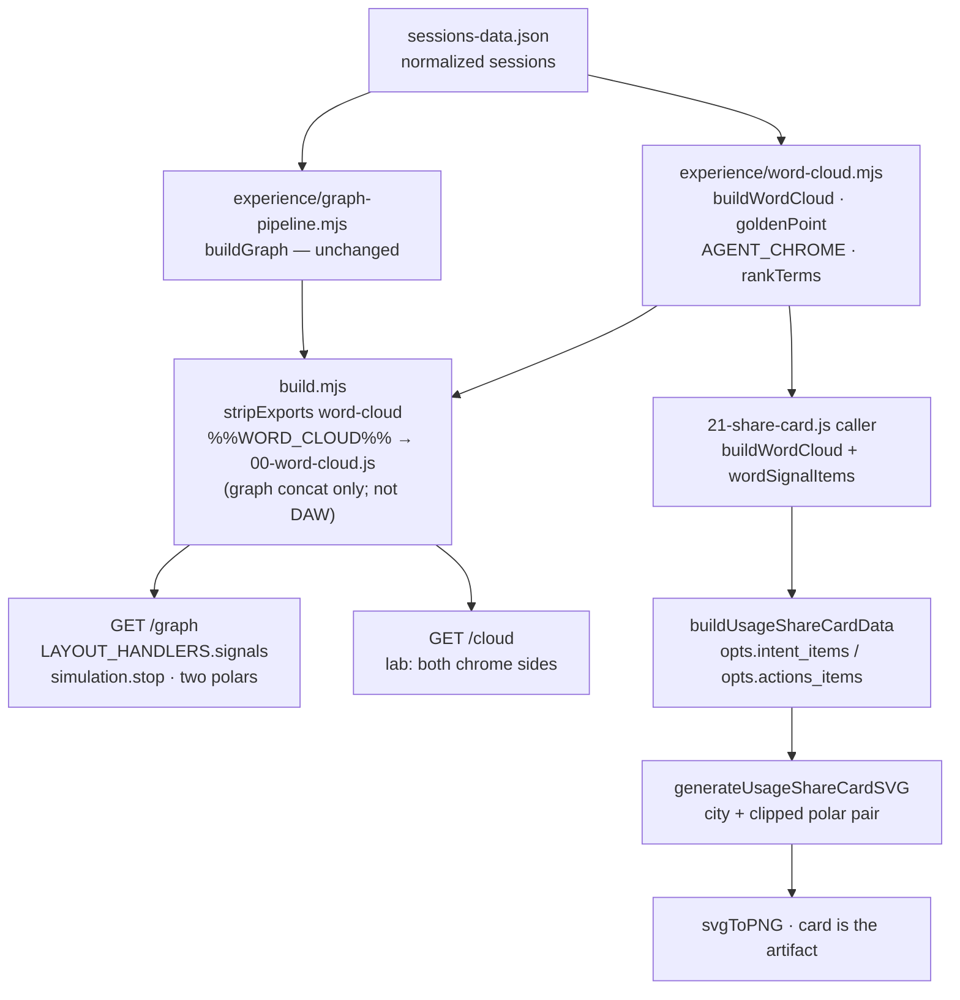

# RFC: Word Signals — collated intent without force

**Project:** kaaroSessions
**Status:** Proposed
**Date:** 2026-09-06
**Author:** kaaroSessions
**Relates to:** [RFC-share-cards.md](./RFC-share-cards.md) (one assembler / one renderer / card-is-the-artifact) · [RFC-me-share-card.md](./RFC-me-share-card.md) (truthful encoding, `TOOL CALLS`, epithet, opt-in `kaaro-display-name`) · [RFC-project-city.md](./RFC-project-city.md) (Lattice default, city field, force is forensic) · Register A (`experience/design-tokens.mjs`, `SHARE_CARD_TOKENS`) · `docs/GRAPH-PERFORMANCE-REQUIREMENT.md` (REQ-GRAPH-PERF-01) · `experience/word-cloud.mjs`
**Grounding:** live `sessions-data.json` on the authoring machine, 2026-09-06. `meta.generated_at` = `2026-09-06T09:44:37.665Z` (a sibling read the same morning was `09:44:10.732Z`). Re-verified by running `buildWordCloud` + `buildGraph` against that dump — **§3 is a snapshot, not a success assertion**. Census **drifts** as JSONL lands.

Copy-verbatim destination in the repo: [`RFC-word-signals.md`](./RFC-word-signals.md).

---

## 1. Problem

Two surfaces that already exist still cannot answer a stranger's first question.

On `/graph`, Lattice is the cadastral map ([RFC-project-city.md](./RFC-project-city.md)) and Force is a forensic instrument (`d3.forceManyBody` + `forceCollide` on hundreds of nodes, SSE restart, `SIM_ALPHA_DECAY = 0.02`). Neither surface collates **what the sessions were about**. A visitor who wants the words has to leave for `/cloud`, which is a lab: six tabs, both agent-chrome on and off, no filter, nothing that leaves the machine.

On the ME share card (Full Usage Canvas), the PNG already tells the truth about worlds (isometric city on seats), counts (`SESSIONS` / `PROJECTS` / `CONSUMPTION` / `TOOL CALLS` / `HEAVIEST`), harness mix (ME wedges), and identity (opt-in wordmark + epithet). It does **not** show the collated intent of the corpus, nor a world-summary sentence a stranger can read without decoding the city. The card that leaves the machine still looks like a map of plots, not a portrait of topics.

`experience/word-cloud.mjs` already proved the missing primitive: one linear pass over normalized `sessions-data.json` → ranked `{t,n,w}[]` bags. No JSONL reread, no TF-IDF, no Wordle collision, no d3-force. Polar / golden-angle / CSS wrap are O(n). The `/cloud` page is the visual exploration of that primitive. This RFC promotes the **Word Signal** (a ranked bag + a cheap polar/wrap renderer) into the two product surfaces that matter: the history engine, and the artifact that leaves the machine.

They share the primitive. They do not share a layout, a force simulation, or a second ME assembler.

---

## 2. Overview

A **Word Signal** is:

1. A ranked bag `{ t, n, w }[]` from `buildWordCloud` (`experience/word-cloud.mjs`).
2. A cheap renderer — golden-angle polar or CSS wrap — that never calls `d3.forceSimulation`, `forceManyBody`, or `forceCollide`.

Two product updates consume it:

| Surface | What a stranger should be able to say |
|---|---|
| `/graph` layout **Signals** | "these are the words the visible sessions meant, these are the tools they used" — without restarting force |
| ME PNG (Full Usage Canvas) | "these are the words I meant, these are the tools I used, this many calls, these are the worlds, this is (or is not) my name" |

Default `/graph` layout stays Lattice. Force stays a button. `/cloud` stays the lab (both agent-chrome sides). The PNG defaults to **topics** (`intent_topic`, agent words off), not "review the code".



Experience never imports `hooks/`. `graph-pipeline.mjs` does not grow a new node type. Word packing does not go through d3-force.

---

## 3. Live grounding (authoring machine, 2026-09-06 snapshot)

From `sessions-data.json` → `buildWordCloud(data)` + `buildGraph(data, { minSessions: 1, includeSubagentNodes: true })`. **Snapshot, not an assertion. Do not `assert.equal(sessions.length, 121)` in tests.**

| Field | Snapshot value |
|---|---|
| `meta.generated_at` | `2026-09-06T09:44:37.665Z` (sibling read `09:44:10.732Z`) |
| Sessions | **121** (`meta.total_sessions`) |
| Projects | **25** (`meta.total_projects` = GRAPH `stats.project`). 28 native `project_id`s before canonical merge — the world line uses **25**. |
| Tokens | 148,944,377 (`fmtTok` → `148.9M`) |
| Tool calls | 6,564 on the first read; 6,593 on a sibling read the same morning — **exact sum of `sess.tool_calls`**, already the `TOOL CALLS` stat |
| Date range | 2025-03-01 → 2026-09-06 |
| Graph nodes | **585** (25 project · 121 session · 11 cluster · 1 subagent · **427 file**) |
| Graph edges | **1,018** |
| Harness mix (session count) | pi 51 · grok 35 · command-code 24 · claude-code 5 · copilot 5 · codex 1 |
| Intent fields present | `ai_title` 60 / `first_user_message` 107 / `skills` 1 / `tools` 98 of 121 |
| `buildWordCloud` bag sizes | `intent` 80 · `intent_topic` 80 · `actions` 43 · months 7 (`2025-03` … `2026-09`) |

**Collated intent, re-verified on this dump** (centre = rank 1…n of `rankTerms`; `n` is weighted document-frequency, not raw token count):

| Bag | Centre (t · n) |
|---|---|
| `intent` (agent words still in) | review 43 · project 36 · card 28 · rfc 28 · share 28 · design 25 · document 25 · file 24. Also: read 22, check 16, write 15. `build` is **absent** from the bag on this dump. |
| `intent_topic` (agent words off) | project 36 · card 28 · rfc 28 · share 28 · design 25 · document 25 · note 21 · system 18 · city 16 · skill 16 · git 14 · test 14. `pulse` is rank 14 (n=12). `review` / `file` / `read` / `write` / `check` / `build` are **gone**. |
| `actions` (`sess.tools.*.calls`) | read_file 1433 · bash 896 · grep 639 · shell_command 629 · run_terminal_command 502 · search_replace 437 · read 417 · write 308 |

The `/cloud` lab tab 1 (INTENT split polar) is this table as two discs. Earlier visual exploration on this branch remembered a slightly different centre (`review, project, file, read, write, check, build` vs `project, card, share, rfc, design, city, pulse, note, git`). The live re-verify above is what a headed smoke will see this morning. Numbers drift; the **shape** does not: agent-chrome-on is work-verbs, agent-chrome-off is topics.

**GRAPH session nodes already carry** `ai_title`, `first_user_message`, `skills`, `tools_top` (top-10 `{name,calls}`), `tool_calls`, `date_str`, `harness`, `project_id` (`experience/graph-pipeline.mjs` lines 128–140). They do **not** carry the full `sess.tools` object. On this dump, folding `tools_top` back into a fake `tools` map and re-running `buildWordCloud` yields the same 43 action names and the same top-8; action-sum undercount is **11 calls** (6,582 vs 6,593). Polar cap 28 does not care. Do not copy full `tools` onto GRAPH nodes (payload bloat). Extend `buildWordCloud` to read `tools_top` when `tools` is absent.

Heaviest world on this dump is still the Pi slug `Users-arshigoyal-kaaro-src-kaaroViewer` (21 sessions, 57.8M) — `humanizeProjectLabel` → `kaaroViewer`. World line example: `kaaroViewer · 25 worlds · 121 runs · 2025-03 → 2026-09`.

---

## 4. Goals & Non-goals

**Goals (v1, PRs 1–3; PR 4 optional):**

1. **Promote the Word Signal primitive.** Ranked `{t,n,w}[]` + golden-angle / wrap renderer, Node-tested, zero npm. Polar math lives in `experience/word-cloud.mjs` next to `AGENT_CHROME`.
2. **A `/graph` layout that stops the sim.** `LAYOUT_HANDLERS.signals` in `experience/client/11-layout-manager.js`, same contract as swimlane / arc / matrix: `simulation.stop()` on enter, no `simulation.alpha(…).restart()`, no new GRAPH node type, no file diamonds. Bags from sessions that pass `sessionMatchesFilters` + `SESSION_FILTERS` (date / harness / project). **Not** `computeClusterHidden` — bundled members still count (Signals is a census, not the cadastral map).
3. **ME card collates two bags, side by side**, on the existing 1200×630 Full Usage Canvas: INTENT = `intent_topic` (agent words off, default, `n >= WORD_SIGNAL_MIN_DF`), ACTIONS = `actions`. City field stays. One assembler (`buildUsageShareCardData`) + one renderer (`generateUsageShareCardSVG`). Polar math is not copied into client-core: the caller passes `wordSignalItems` arrays.
4. **World summary line on the PNG**, not only in share text.
5. **Named vs anon is visible on the PNG.** Empty display name = blank wordmark + epithet-only footer + filename `kaaro-usage-card.png`. Named = sanitized 24-char wordmark + `kaaro-<slug>-<ym>.png`. Overlay gains an explicit ANON affordance.
6. **Keep `TOOL CALLS`** as the exact sum of session `tool_calls` (already assembled and drawn — confirm, do not re-implement).

**Non-goals (do not reopen, do not sneak in):**

- d3-force packing of words. No `d3-cloud`, no Wordle, no `forceCollide` on text nodes.
- Making Force the default, or changing Lattice as the `/graph` default ([RFC-project-city.md](./RFC-project-city.md) KD 6).
- A new GRAPH node type, session-node labels from the top intent token, or file diamonds in the Signals layout.
- A second ME assembler / `generateIntentShareCardSVG`.
- Replacing the city field with clouds. Hash mosaic, contribution-graph strip as the field, exact hex↔ball docking (already rejected, [RFC-share-cards.md](./RFC-share-cards.md) §5).
- Printing raw `first_user_message`, `ai_title` strings, file paths, or home-directory slugs on the PNG. Username **tokens** (`arshigoyal` after `tokenizeText` splits `/Users/arshigoyal/…`) are **not** guaranteed dropped — see §9.
- Defaulting the PNG to the agent-chrome-on bag (`intent`). `/cloud` keeps both sides; the leaving artifact does not.
- LLM topic extraction, TF-IDF, stopword-lists beyond `CLOUD_STOPWORDS` / `PATH_CRUMBS` / `AGENT_CHROME`.
- Copying full `sess.tools` onto GRAPH session nodes. `tools_top` is enough.
- `experience/` importing `hooks/`. Runtime npm. Feature-flag infra (none exists).
- jsdom tests for `21-share-card.js` / `22-word-signals.js` (documented coverage gap). Polar math + assembler + SVG strings are Node-tested.
- Changing `SIM_ALPHA_DECAY`, file-checkbox defaults, or REQ-GRAPH-PERF-01 gates "to make Signals look cheaper". Signals is off the force budget because it **stops the sim**.
- Fabricated public URL. `buildShareText` still never invents one.

---

## 5. Proposed design

### 5.1 The Word Signal primitive

Already shipped, lab-only:

| Export | Role |
|---|---|
| `buildWordCloud(data, opts)` | One pass → `{ intent, intent_topic, stems, actions, months, session_count, generated_at }` |
| `sessionIntentWeights(sess)` | `ai_title` ×2 + `first_user_message` ×1 + skills ×2 |
| `AGENT_CHROME` | Optional strip so topics survive (`rfc`, `city`, `kaaro`, `git`) and work-verbs die (`review`, `build`, `check`, `write`, `read`, `file`) |
| `PATH_CRUMBS` | Always dropped (`users`, `src`, `home`, `users-arshigoyal`, …). Drops the **compound** crumb `users-arshigoyal`, **not** the username token `arshigoyal` (`tokenizeText` splits on `[^a-z0-9]+`) |
| `CLOUD_STOPWORDS` | English function words, always dropped |
| `goldenPoint(i, n)` | Golden-angle point in the unit square; i=0 near centre; O(1) per term; **no collision test** |
| `rankTerms` / `mergePlurals` / `dropTruncations` | Stable rank, plural fold, truncated-stem drop |

v1 additions in the same module (PR 1). **Three exports, one file-private escaper. The split composer is not in this file.**

```
export const WORD_SIGNAL_MIN_DF = 3;       // PNG floor only; Signals layout does not apply it

wordSignalItems(terms, { cap, fontMin, fontMax, trunc } = {}) →
  { t, n, w, x, y, fontPx, label }[]
  // unit-square x,y from goldenPoint; label = trunc of t (default trunc 22)
  // empty / missing terms → []

wordSignalSvg(terms, {
  x, y, w, h,
  cap = 28, fontMin = 9, fontMax = 11, trunc = 10,
  fillFor,                                 // (w) => colour string; required for SVG
  unit = '',
  clip = true,                             // wrap in <svg x y width height> (implicit clip)
} = {}) → string
  // <svg> wrapper (not a bare inner fragment) so overflow clips to the pane.
  // Each <text> has text-anchor="middle" (parity with cloud translate(-50%,-50%)).
  // Empty → one dim <text> "no terms" at pane centre.

wordSignalHtml(terms, {
  cap = 40, fontMin = 10, fontMax = 28, trunc = 22, unit = '',
} = {}) → string
  // polar <div class="polar">; colours via CSS variables
  // (--k-data / --k-label / --k-body / --k-dim), so NO fillFor.
  // Empty → <div id="empty">━━━ no terms ━━━</div> (same copy as /cloud).
```

File-private `cloudEsc(s)` — the same five-entity replace as `esc` in client-core (`& < > " '`). **Must not be named `esc` or `export function esc`:** `%%WORD_CLOUD%%` and `%%CLIENT_CORE%%` share one classic-script scope on `/graph`; a second `function esc` is a duplicate-declaration SyntaxError. Terms from `tokenizeText` are `[a-z0-9]+` (empirically safe); **tool names on `actions` are raw** (`read_file`, `Bash`, possibly `custom_tool_call`) and must go through `cloudEsc`.

`fillFor` exists only on `wordSignalSvg`. Register A mapping is the SVG caller's job:

```
function signalFill(w, c) {
  if (w >= 0.7) return c.data;    // #e8e000
  if (w >= 0.4) return c.label;   // #ffaa00
  if (w >= 0.2) return c.body;    // #ccccaa
  return c.dim;                   // #445544
}
```

`wordSignalHtml` reads the same steps from CSS custom properties (already on `template.html` via `%%TOKENS_CSS%%`).

No shadows, no gradients, no `rx > 2`, no blue chrome. IBM Plex Mono.

**Locked per-surface paint opts:**

| Surface | function | cap | fontMin–fontMax | trunc | clip / CSS |
|---|---|---|---|---|---|
| PNG INTENT / ACTIONS | `wordSignalSvg` (or items → `<text>` in the renderer) | **28** | **9–11** | **10** | `<svg width height>` wrapper (implicit clip) + `text-anchor="middle"` |
| `/graph` Signals | `wordSignalHtml` | **40** | **10–28** | 22 | `.polar` / `.split` from `cloud.html` **minus** `min-height:420px` |
| `/cloud` lab | page-local until PR 4 | 80 / 40 | 10–28 | 22 | `.polar { min-height:420px }` stays on the lab only |

The 283×132 PNG disc is **not** `/cloud` occupancy (lab polar is `min-height:420px` at 10–28px). Overlap is accepted; clip is how we keep overflow off the neighbour pane and out of the divider. Headed-smoke screenshot of the PNG is the readability gate, not a collision solver.

**Split composer is not an export of `word-cloud.mjs`.** `wordSignalSplitMarkup(topicTerms, actionTerms)` lives in `experience/client/22-word-signals.js` and composes two labeled panes around `wordSignalHtml`. PR 2 implements it; PR 1 does not.

**`tools_top` adapter** (tiny, justified; not a graph-pipeline change):

```
function toolEntries(sess) {
  if (sess?.tools && typeof sess.tools === 'object' && !Array.isArray(sess.tools)) {
    return Object.entries(sess.tools).map(([name, info]) => [name, toolCalls(info)]);
  }
  if (Array.isArray(sess?.tools_top)) {
    return sess.tools_top.map(x => [x.name || '', x.calls || 0]);
  }
  return [];
}
```

`buildWordCloud` already ignores `n <= 0`. Tests: a GRAPH-shaped session `{ tools_top: [{ name: 'read_file', calls: 4 }] }` produces the same `actions` row as `{ tools: { read_file: { calls: 4 } } }`.

Overlap is accepted. Golden-angle is not a packing solver. The lab at `/cloud` already ships this; the PNG and the Signals layout inherit it. Cap is how we keep type readable, not a collision loop.

### 5.2 Injection path — pick (b), graph-only module, do not duplicate `AGENT_CHROME`

`client-core.mjs` has no import graph. It is injected as plain script via `%%CLIENT_CORE%%` (`build.mjs` `loadClientCore()` → `stripExports()`, regex `^export (async function|function|const)`). `experience/word-cloud.mjs` currently has **zero imports** and only `export function` / `export const` — it already satisfies the same syntax contract.

**Locked: option (b), placeholder location = graph-only module.** `build.mjs` grows `loadWordCloud()` (same `stripExports` as client-core) and injects `%%WORD_CLOUD%%` **only** into:

| Artifact | Where |
|---|---|
| `graph.html` | **new** `experience/client/00-word-cloud.js` whose body is the single line `%%WORD_CLOUD%%`. `orderClientModules` concatenates every `NN-*.js` into the graph bundle; DAW does **not**. |
| `cloud.html` | optional in PR 4; lab can keep its page-local `goldenPoint` until then |
| `now.html` / `home.html` / **DAW** | **not** injected. `buildDaw()` concatenates only `00-core.js`, `14-pulse-audio.js`, `19-daw-builder.js`. |

**Do not put `%%WORD_CLOUD%%` in `00-core.js`.** That file is shared with the DAW bundle. `applySubstitutions` leaves unknown placeholders intact (`subs[k] ?? k`). A leftover `%%WORD_CLOUD%%` is not valid JS (`%%` is not an operator) — `/daw` would throw `SyntaxError` the moment PR 1 landed. Empty-substituting it in `buildDaw()` is a fallback, not the design: the placeholder must not appear in DAW's module list at all.

`00-core.js` stays:

```
const KAARO_TOKENS = %%KAARO_TOKENS%%;
%%CLIENT_CORE%%
```

`00-word-cloud.js` (new, graph-only):

```
%%WORD_CLOUD%%
```

Graph `applySubstitutions` map gains `'%%WORD_CLOUD%%': loadWordCloud()`. DAW map does **not**. `test/build-template.test.mjs` KNOWN-placeholder set gains `%%WORD_CLOUD%%`. **PR 1 adds a DAW-bundle assertion** that `daw-builder.html` contains no leftover `%%[A-Z_]+%%`.

Why not (a) (tiny `wordSignalMarkup` inside client-core)? It would duplicate `goldenPoint` **and** tempt a copy of `AGENT_CHROME` (40+ verbs). Chrome drift is the failure mode that makes the PNG say `review` again. Keep chrome in one module.

Why not inject into `01-data.js`? That file is GRAPH JSON. A dedicated `00-word-cloud.js` makes the DAW exclusion obvious (DAW's curated list will never grow a data module) and keeps `stripExports` output next to, not inside, `%%GRAPH_JSON%%`.

Node tests import `experience/word-cloud.mjs` as ESM (already: `test/word-cloud.test.mjs`). Browser graph code calls the stripped globals (`buildWordCloud`, `wordSignalItems`, `wordSignalSvg`, `wordSignalHtml`, `goldenPoint`).

**Locked split for the PNG renderer — no goldenPoint copy:**

- Bags always come from `buildWordCloud` (one `AGENT_CHROME`). Caller (`21-share-card.js`) runs it in the browser, applies `WORD_SIGNAL_MIN_DF`, then `wordSignalItems(...)`.
- Assembler stores **pre-rendered items** (`intent_items` / `actions_items`) plus the bags (for tests that assert term strings). It does not tokenize and does not import `word-cloud.mjs`.
- `generateUsageShareCardSVG` maps `data.intent_items` / `data.actions_items` to `<text x y font-size fill text-anchor="middle">` inside a per-pane `<svg x y width height>` (implicit clip). **It does not reimplement `goldenPoint`.** Node tests import `wordSignalItems` from `word-cloud.mjs` and pass fixture items in `opts` — one polar painter, no formula drift.

Do not add `import` to `word-cloud.mjs`. Do not add `export async function` there (`stripExports` already supports it; we do not need it). Do not `export function esc`.

### 5.3 ForceGraph engine — Signals is a layout that stops the sim

**Product question:** a stranger on `/graph` should read the collated intent of the **visible** sessions without restarting `d3.forceManyBody`.

**Pick: a new layout handler, not an overlay, not node labels.**

Why this and not the other two:

| Option | Verdict |
|---|---|
| **Layout `signals`** (picked) | Identical contract to swimlane / arc / matrix: `enter()` calls `simulation.stop()`, hides node/edge/label layers, paints its own view. `applyFilters` early-returns and re-paints. SSE `updateGraph` already calls `LAYOUT_HANDLERS[currentLayout].enter()` — Signals `enter` must stop the sim **again** after `updateGraph` reassigns `simulation.nodes` (swimlane already does this). No new GRAPH nodes. Filter-aware. Full canvas, readable type. |
| Overlay docked in controls | The controls widget is ~280px. 28–40 terms at 9–11px need the canvas. An overlay on Lattice/Force would either sit on top of buildings or fight the sim. Recompute-on-filter is cheap, but the paint target is wrong. Rejected for v1. A later HUD chip that *opens the Signals layout* is fine; it is not the surface. |
| Session-node labels from top intent token | 121 labels on this dump, titles are sentences, tokens jitter on every SSE `updated`. Lattice already labels the heaviest plots. Force labels are project names. A third label language on the same marks is noise. Rejected. |

**Default stays Lattice.** `let currentLayout = 'grid'` in `04-rendering.js`. Boot in `20-glyph-board.js`:

```
const HASH_LAYOUTS = new Set(['force', 'swimlane', 'arc', 'matrix', '3d']);
```

gains `'signals'`. No hash → Lattice (`setLayout('grid', { forceEnter: true })`). `#force` → Force. `#signals` → Signals. Force remains a button (`#force`, shortcut `f`). Shortcut `p` still toggles Lattice ↔ Force. **New shortcut `w`** → `setLayout('signals')`. `g` stays 3D (graph page); do not steal it.

**Handler** (`experience/client/11-layout-manager.js`), same shape as `matrix` (separate DOM, sim stopped):

```
signals: {
  controls: [],
  enter() {
    document.getElementById('canvas').style.display = 'none';
    document.getElementById('matrix-view').style.display = 'none';
    document.getElementById('three-view').style.display = 'none';
    const el = document.getElementById('signals-view');
    if (el) el.style.display = 'block';
    simulation.stop();
    renderWordSignals();
  },
  exit() {
    const el = document.getElementById('signals-view');
    if (el) el.style.display = 'none';
  }
}
```

`setLayout` always `exit()` then `enter()`, so the happy path hides Signals. **Belt and suspenders:** every existing `enter()` that already sets `#matrix-view { display:none }` (force, grid via force.enter, swimlane, arc, 3d) also sets `#signals-view { display:none }`. A missed `exit()` must not leave two views stacked. `isSimLayout()` is already `force || grid` (`04-rendering.js` line 3); Signals is off the force budget without touching `03-simulation.js` / `06-force-layout.js` / `SIM_ALPHA_DECAY`.

`restoreForceLayout` / `simulation.alpha(0.25).restart()` live only in `LAYOUT_HANDLERS.force.enter` (and Lattice, which **calls** `force.enter()` then pins). Signals must not go through that path. Cite: `experience/client/03-simulation.js` builds `d3.forceSimulation(GRAPH.nodes).force('charge', d3.forceManyBody()…).force('collision', d3.forceCollide(…)).alphaDecay(SIM_ALPHA_DECAY)` with `SIM_ALPHA_DECAY = 0.02` (`experience/client-core.mjs` line 126). REQ-GRAPH-PERF-01 Gate A is `ln(0.001)/-0.02 ≈ 345` ticks ≈ 5.8s. Swimlane/arc/matrix are explicitly **out** of that budget (`docs/GRAPH-PERFORMANCE-REQUIREMENT.md` §2: "stop the force sim on enter (`11-layout-manager.js`); not the load-jank path"). Signals joins that set.

**Paint** (`experience/client/22-word-signals.js` — next numbered module after `21-share-card.js`; `orderClientModules` requires `NN-name.js`):

```
function visibleSessions() {
  // Census filter: date / harness / project only.
  // Bundled (cluster-hidden) members still count — Signals is not the map.
  return GRAPH.nodes.filter(n =>
    n.type === 'session' && sessionMatchesFilters(n, SESSION_FILTERS));
}

function wordSignalSplitMarkup(topicTerms, actionTerms) {
  return '<div class="split">' +
    pane('INTENT', wordSignalHtml(topicTerms, { cap: 40, fontMin: 10, fontMax: 28 })) +
    pane('ACTIONS', wordSignalHtml(actionTerms, { cap: 40, fontMin: 10, fontMax: 28 })) +
  '</div>';
}

function renderWordSignals() {
  const cloud = buildWordCloud({ sessions: visibleSessions() }, { limit: 40 });
  const el = document.getElementById('signals-view');
  el.innerHTML = wordSignalSplitMarkup(cloud.intent_topic, cloud.actions);
}
```

Two panes, labeled **INTENT** and **ACTIONS**, golden-angle polar via `wordSignalHtml` (CSS variables, not `fillFor`). Polar CSS is copied from `experience/pages/cloud.html` `.polar` / `.split` / `.w` **minus** `min-height:420px` — Signals pane is the viewport (`#signals-view` fills under `#layout-bar`). INTENT is `intent_topic` (agent words off) — the graph layout matches the PNG default. A small toggle "agent words" that swaps INTENT to `cloud.intent` is **lab-only** (`/cloud`); do not put it on `/graph` v1. The lab exists so we can still see chrome-on.

Signals does **not** apply `WORD_SIGNAL_MIN_DF`. A 1-session date/harness filter is a local reconstruction of that session's title + 200-char prompt tokens — acceptable on `/graph` (local-only), stated in §9. The PNG is the leaving artifact and **does** floor df.

`applyFilters` (`experience/client/12-controls.js`) gains, **immediately after the `arc` block** and **before** the `simulation.nodes(visNodes)` + `alpha(0.15).restart()` foot-gun (today ~lines 78–80):

```
if (currentLayout === 'signals') { renderWordSignals(); return; }
```

Filter change is O(n) over matching sessions (121 on this dump; worst case hundreds). Never `simulation.alpha(0.3).restart()`.

Resize (`experience/client/13-live-updates.js`, the branch that already repaints matrix / swimlane / arc / 3d): `if (currentLayout === 'signals') renderWordSignals();`. Without this, Signals goes stale on window resize.

`window.updateGraph` (`13-live-updates.js`) currently always:

```
simulation.nodes(GRAPH.nodes);
simulation.force('link').links(GRAPH.edges);
…
LAYOUT_HANDLERS[currentLayout]?.enter?.();
applyFilters();
```

Signals `enter` stops the sim after that reassignment. Do **not** special-case `updateGraph` in v1 (swimlane doesn't). Optional later: skip `simulation.nodes` when `!isSimLayout()` — out of this RFC.

**Markup** in `experience/pages/template.html`:

- `#layout-bar`: `<button class="lay-btn" data-layout="signals">Signals</button>` after Lattice (Force remains first; Lattice stays `active` default).
- `<div id="signals-view"></div>` next to `#matrix-view`. Hidden by default (`display:none`). Register A CSS in the same file: `.split` / `.polar` / `.polar .w` copied from `cloud.html` **without** `min-height:420px`; `position:absolute; transform:translate(-50%,-50%)` on `.polar .w`; no radius > 2px, no shadow, no blue. `test/design-lint.test.mjs` already lints `template.html`.

**Cost line** on the Signals view (statusbar or pane header): `N sessions · 1 pass · no force` — same claim as `/cloud`'s `#cost`.

Do not add file diamonds. Do not add cluster nodes. Do not run `joinNodes`. The city on Lattice is the map; Signals is the index.

### 5.4 Share card — Collated Intent via Word Signals

**Product question:** the ME PNG a stranger sees should answer

> these are the words I meant, these are the tools I used, this many calls, these are the worlds, this is (or is not) my name.

Stay inside `buildUsageShareCardData` + `generateUsageShareCardSVG`. Preview / share / download still call the same pair ([RFC-share-cards.md](./RFC-share-cards.md) §2). City stays ([RFC-project-city.md](./RFC-project-city.md) §11.3). Double-spiral does not come back.

#### 5.4.1 Assembler

`buildUsageShareCardData(me, opts)` gains (all optional; missing → empty bags / empty items / empty world line):

```
intent_topic:  { t, n, w }[]                          // NEW — bags, for string tests
actions:       { t, n, w }[]                          // NEW
intent_items:  { t, n, w, x, y, fontPx, label }[]     // NEW — from wordSignalItems
actions_items: { t, n, w, x, y, fontPx, label }[]     // NEW
world_line:    string                                 // NEW — usageWorldLine(...)
```

The assembler does **not** tokenize, does **not** import `word-cloud.mjs`, and does **not** call `goldenPoint`. It stores what it is given (items are the paint input; bags are the test input), plus:

```
world_line: usageWorldLine({
  topProjectShort, project_count, total_sessions, dateFrom, dateTo,
})
```

`usageWorldLine` is a new exported helper in `client-core.mjs`, Node-tested. Heaviest is truncated to the same 18 chars as the HEAVIEST stat / epithet so a long remainder cannot collide with a 24-char wordmark in the 80 px header (`letter-spacing:3px` at 20px):

```
export function usageWorldLine({ topProjectShort, project_count, total_sessions, dateFrom, dateTo }) {
  const bits = [];
  if (topProjectShort) bits.push(_shareTrunc(topProjectShort, 18));
  if (project_count) bits.push(`${project_count} world${project_count === 1 ? '' : 's'}`);
  if (total_sessions) bits.push(`${total_sessions} run${total_sessions === 1 ? '' : 's'}`);
  const a = dateFrom ? String(dateFrom).slice(0, 7) : '';
  const b = dateTo   ? String(dateTo).slice(0, 7)   : '';
  if (a && b) bits.push(`${a} → ${b}`);
  else if (a || b) bits.push(a || b);
  return bits.join(' · ');
}
```

This dump: `kaaroViewer · 25 worlds · 121 runs · 2025-03 → 2026-09`. Empty canvas → `''`.

**Caller** (`experience/client/21-share-card.js`, `#me-share-btn`). Must pass `cloud.intent_topic`, never `cloud.intent`. Floor df **before** `wordSignalItems` (cap 28 would otherwise keep hapaxes):

```
const PNG_SIGNAL_OPTS = { cap: 28, fontMin: 9, fontMax: 11, trunc: 10 };
const sessions = GRAPH.nodes.filter(n => n.type === 'session');
const cloud = typeof buildWordCloud === 'function'
  ? buildWordCloud({ sessions }, { limit: 40 })
  : { intent_topic: [], actions: [] };
const intent_topic = (cloud.intent_topic || []).filter(t => t.n >= WORD_SIGNAL_MIN_DF);
const actions      = (cloud.actions || []).filter(t => t.n >= WORD_SIGNAL_MIN_DF);
const cardData = buildUsageShareCardData(meGlyph(sessions), {
  …existing,
  intent_topic,
  actions,
  intent_items:  typeof wordSignalItems === 'function' ? wordSignalItems(intent_topic, PNG_SIGNAL_OPTS) : [],
  actions_items: typeof wordSignalItems === 'function' ? wordSignalItems(actions, PNG_SIGNAL_OPTS) : [],
});
```

`buildWordCloud` / `wordSignalItems` / `WORD_SIGNAL_MIN_DF` are injected globals from `%%WORD_CLOUD%%` (`00-word-cloud.js`). Pass **GRAPH sessions**, not a second read of `sessions-data.json`. Intent bags match because `ai_title` / `first_user_message` / `skills` are already on the nodes. Action bags use `tools_top` (PR 1 adapter). Missing globals → empty items → renderer empty-state, not a throw.

Do not pass `cloud.intent` (chrome-on) into the assembler. The PNG default is topics. `generateUsageShareCardSVG` paints from `data.intent_items` / `data.actions_items` only — if a test (or a buggy caller) stuffs chrome-on terms into `intent_topic` but leaves `intent_items` empty, the pane shows `no terms`, not `review`. The product test in PR 3 therefore **must** go `buildWordCloud` → filter min-df → `wordSignalItems` → assembler → SVG (see §11 / PR 3).

#### 5.4.2 Fit / geometry — numbers, not vibes

`_shareGeom()` is **unchanged**:

```
width 1200  height 630
headerH 80  footerH 70
bodyTop 80  bodyBot 560
dividerX 660  leftPad 55  rightPad 700
```

Current usage-card body (`generateUsageShareCardSVG` today):

```
          0                         660                        1200
        0 ┌─────────────────────────────────────────────────────────┐
          │ wordmark 20px                              date range   │  y=34
          │ kicker 9px                                              │  y=58
       80 ├──────────────────────────────┬──────────────────────────┤
          │ CITY                         │ STATS @ 700              │
          │ fieldX0=55  fieldX1=630      │  SESSIONS / PROJECTS /   │
          │ y0=100  y1=514  (414 px)     │  CONSUMPTION / TOOL CALLS│
          │ fitCityToField               │  HEAVIEST                │
          │                              │  ME (1020.4, 320) r=56   │
          │ pulse strip y=522 h=10       │  WEDGES y=402            │
          │ caption y=542                │  legendY0=412            │
      560 ├──────────────────────────────┴──────────────────────────┤
          │ epithet                                       ◆ KAAROSESSIONS
      630 └─────────────────────────────────────────────────────────┘
```

Right column is full: five stats (startY 124, pitch 50, last value y=346), ME backing y∈[254,386] x∈[954.4,1086.4], WEDGES at 402, legend 412 + 6×18 = 502 on this 6-harness dump. **There is no room for two polars in the right column** without shrinking ME or collapsing the legend — both rejected (ME r=56 is the v3 lesson; legend collapse was a non-goal of RFC-me-share-card KD 5).

Left field is 575×414 for the city, plus a 46px gutter (514→560) that already holds the monthly pulse strip (PR 3 of RFC-me-share-card) and the city caption.

Two golden-angle polars at readable type need a band, not a caption line. **Do not claim `/cloud` occupancy.** Lab polar is `.polar { min-height: 420px }` at `fontPx(w, 10, 28)` with CSS `translate(-50%,-50%)`. The PNG disc is **283×132** at 9–11px. That is a denser, smaller budget; clip + shorter trunc + `text-anchor="middle"` are how it stays inside the pane, not a packing solver. Headed-smoke screenshot of the PNG is the readability gate.

**v1 crop, locked:**

1. **Shrink the city in the renderer only.** `generateUsageShareCardSVG` calls `fitCityToField(city, { x0:55, y0:100, x1:630, y1:360 })` — **260 px** tall, still 575 wide. **`fitCityToField`'s default `y1` stays 514** (landing / other callers). Do not change the helper default. Existing AABB in `test/city.test.mjs` (~line 225) against `[55,630]×[100,514]` stays. **Add** a usage-card AABB test that calls the **renderer rect** `{ x0:55, y0:100, x1:630, y1:360 }` (in `test/city.test.mjs` or `test/client-core.test.mjs`) — 25 buildings on this dump (cap 60) scale uniformly; `CITY_FIT_CELL_R_MAX = 36` still binds sparse n=2.
2. **Drop the monthly pulse strip from the usage PNG.** `data.months` stays assembled (do not rip `_seedUsageMonths`); the renderer skips it. Recency already lives on city roofs. `/cloud` months tab remains the calendar. **Rewrite** the live pulse-strip test in `test/client-core.test.mjs` (~line 1665) that asserts `y="522"` / caption `y="542"`: after PR 3 there are **no** `y="522"` strip rects, and the city caption is at **y=372**.
3. **Word Signal pair** in the vacated band:

```
city:    y 100–360     (260 px)   isometric buildings, unchanged markup
caption: y 372         9px, no letter-spacing, existing city string
signals: y 384–548     (164 px)
  INTENT  x 55–338     (283×164)
  ACTIONS x 347–630    (283×164)
  pane hd y 396        8px dim, letter-spacing 1.5px, "INTENT" / "ACTIONS"
  polar   y 408–540    (132 px disc)   <svg x y width=283 height=132>
```

Worked widths (5.4 px/glyph, 9px):

| String | chars | px | budget |
|---|---|---|---|
| city caption `◆ footprint = consumption · height = sessions · diamonds = working set` | 62 | 335 | 575 |
| plus ` · +99 projects more` | 82 | 443 | 575 |
| world line `kaaroViewer · 25 worlds · 121 runs · 2025-03 → 2026-09` | 53 | 382 at 12px (~7.2 px/glyph) | header right ~445 (x 700–1145) |
| pane label `INTENT` / `ACTIONS` | 7 / 7 | 8px letter-spacing 1.5 | 283 |

**PNG polar paint (locked, not optional):**

- Each pane is a nested `<svg x="…" y="408" width="283" height="132">` (implicit clip to the disc). A 9 px gap at x 338–347 is **not** a margin you can paint into.
- Every term `<text text-anchor="middle" x="{x*283}" y="{y*132}" font-size="{fontPx}">` — parity with cloud `translate(-50%,-50%)`. Without middle-anchor, a 10-char label at 11px (~66 px) whose `goldenPoint` x is 0.92 sits 66 px past the pane edge.
- `fontMin=9`, `fontMax=11`, `cap=28`, `trunc=10`. A 10-char label at 11px is ~66 px; half-width 33 px vs 0.08×283 ≈ 23 px still clips at the rim — **that is what the `<svg>` wrapper is for**. Trunc 16 / fontMax 13 is rejected (half-width 62 px against a 23 px margin, and 9 px of pane gap).
- `cloudEsc` / `esc()` every `label`. Empty items → one dim `no terms` at the pane centre.
- Coordinates come from `data.intent_items` / `data.actions_items` (`wordSignalItems`); the renderer does not call `goldenPoint`.

**Do not** put terms in the right column. **Do not** shrink `meR=56`. **Do not** revive session balls. **Do not** print `n` counts on the PNG (the polar size *is* the count; a ledger of 28 numbers is a second card).

#### 5.4.3 Header / identity / world line

| Slot | Named (`displayName` set) | Anon (`displayName === ''`) |
|---|---|---|
| y=34 wordmark | uppercase sanitized name (`ARSHI`) | **blank** (omit the `<text>`) |
| y=58 kicker | `FULL USAGE CANVAS · INTELLIGENCE TRACE` | same |
| y=34 dateRight | **world line** (`usageWorldLine`) | same |
| y=58 subRight | full ISO `dateFrom → dateTo` (moves down from today's dateRight) | same |
| footer tagLine | epithet | epithet |
| footer right | `◆ KAAROSESSIONS` | `◆ KAAROSESSIONS` |
| filename | `kaaro-<slug>-<ym>.png` | `kaaro-usage-card.png` |

This **updates** RFC-me-share-card KD 6. That RFC said unset name = product wordmark `KAAROSESSIONS`. This RFC makes named vs anon **visible on the still**: a stranger must be able to see that a name was withheld. Product identity stays in the footer. Session and project cards are unchanged (`_shareHeader` default remains `KAAROSESSIONS` unless `blankWordmark: true`).

`_shareHeader` gains `blankWordmark`. Usage renderer passes `blankWordmark: !data.displayName` and `dateRight: data.world_line`, `subRight: dateRange`.

`usageShareFilename` / `applyDisplayName` already implement the filename rule ([RFC-me-share-card.md](./RFC-me-share-card.md) §4.8). No change except tests that today's unsigned usage card contains `KAAROSESSIONS` at y=34 must flip: unsigned usage card **omits** that 20px mark.

#### 5.4.4 TOOL CALLS — already on the card

`generateUsageShareCardSVG` stats array today (line 2085–2091):

```
['SESSIONS',    String(data.total_sessions)],
['PROJECTS',    String(data.project_count)],
['CONSUMPTION', fmtTok(data.tokens_total)],
['TOOL CALLS',  String(data.tool_calls)],
['HEAVIEST',    _shareTrunc(data.topProjectShort, 18)],
```

`data.tool_calls` is `rawSessions.reduce((n, s) => n + (s.tool_calls || 0), 0)` in `buildUsageShareCardData`. Printed with `String(…)`, not `fmtTok` (so this dump is `6593`, not `7k`). **v1 fix is: keep it.** Tests already (or must continue to) assert the SVG contains `TOOL CALLS` and the exact sum. This RFC does not add a sixth stat.

Share text (`buildShareText` usage branch) today is title + epithet + `N sessions · N projects · N tokens` + ISO range. v1 adds the world line and the tool-call count so the OS share sheet matches the PNG:

```
📊 arshi's kaaroSessions canvas          // or "My kaaroSessions canvas"
6-harness operator · Pi-native · 18 months · heaviest world: kaaroViewer
kaaroViewer · 25 worlds · 121 runs · 2025-03 → 2026-09
121 sessions · 25 projects · 148.9M tokens · 6593 tool calls
2025-03-01 → 2026-09-06
```

Still no URL.

#### 5.4.5 Overlay ANON affordance

Today (`21-share-card.js` `_showPreview`): one `<input placeholder="SIGN YOUR CARD (OPTIONAL)">`. Clearing the field on blur **is** anon (`localStorage.removeItem('kaaro-display-name')` + `applyDisplayName(…, '')`). That is invisible.

v1, usage preview only (Register A inline styles, `border-radius:0`, no shadow):

```
[ ANON ]  [ input: SIGN YOUR CARD (OPTIONAL) ]
empty = anonymous · wordmark blank · kaaro-usage-card.png
```

- `ANON` is a `<button class="paction">` that sets `input.value = ''` and calls the existing `commit()`.
- Helper copy under the row, 10px dim: `anonymous unless signed`.
- Input placeholder stays. Named commit still writes `kaaro-display-name`.
- Let-box contract unchanged: Share rasters `box.svg` after commit ([RFC-me-share-card.md](./RFC-me-share-card.md) §4.8). `applyDisplayName` does not touch bags / city / epithet.

`21-share-card.js` stays in the coverage gap. Sanitize / `applyDisplayName` / header blanking are Node-tested. Overlay is browser-smoked on the PR checklist.

---

## 6. API / interface changes

No HTTP API change. `GET /cloud` stays. `GET /graph` gains a layout, not a route. No `sessions-data.json` schema change.

New / extended exports from `experience/word-cloud.mjs`:

```
WORD_SIGNAL_MIN_DF          // 3; PNG floor. Signals layout does not apply it.
wordSignalItems
wordSignalSvg               // SVG path; fillFor required; <svg> wrapper clips
wordSignalHtml              // HTML polar; CSS variables; no fillFor
```

`cloudEsc` is **file-private** (not exported, not named `esc`). `toolEntries` is file-private; tests go through `buildWordCloud`. `wordSignalSplitMarkup` is **not** in this module — it lives in `22-word-signals.js`.

`buildWordCloud` additionally reads `sess.tools_top`.

New exports from `experience/client-core.mjs`:

```
usageWorldLine              // _shareTrunc(topProjectShort, 18) inside
```

`buildUsageShareCardData` return shape additions: `intent_topic`, `actions`, `intent_items`, `actions_items`, `world_line`. `_shareHeader` optional `blankWordmark`. `generateUsageShareCardSVG` paints items; it does not import or copy `goldenPoint`.

`build.mjs`: `loadWordCloud()`; `'%%WORD_CLOUD%%': loadWordCloud()` on the **graph** substitution map only. New `experience/client/00-word-cloud.js`. `stripExports` unchanged. DAW map unchanged. `test/build-template.test.mjs` KNOWN set += `%%WORD_CLOUD%%`; DAW artifact asserts no leftover `%%[A-Z_]+%%`.

`HASH_LAYOUTS` gains `'signals'`. `SHORTCUTS_DEF` gains `w`. `orderClientModules` picks up `00-word-cloud.js` and `22-word-signals.js` by numeric sort.

---

## 7. Data model changes

None in analyze. Word Signals are a view of fields GRAPH already has (`ai_title`, `first_user_message`, `skills`, `tools_top`, `tool_calls`).

**Migration:** none. `kaaro-display-name` shape unchanged. Anon-default is a renderer change (blank wordmark), not a storage change. Reverting PR 3 restores the product wordmark on unsigned cards; a stored name still signs.

**Not copied onto GRAPH:** full `sess.tools`, `file_ops` (city already uses file edges). `first_user_message` is already on the node (capped at 200 chars in `hooks/session-reducer.mjs`; `ai_title` is not capped) — the graph page JSON already contains prompts. Word Signals emit aggregated tokens only. PNG additionally floors document-frequency (`WORD_SIGNAL_MIN_DF = 3`); Signals layout does not.

---

## 8. Alternatives considered

| Option | Why not |
|---|---|
| Force-pack words (`d3.forceCollide` on text, d3-cloud, Wordle) | The branch's actual finding: force is forensic and expensive. Polar / wrap are O(n). REQ-GRAPH-PERF-01 exists because manyBody+collide on hundreds of nodes is the cost. Putting words into that sim is how `/graph` gets worse. Forbidden. |
| Overlay on Lattice/Force, recompute on filter, never restart sim | Cheap, but the paint target is a ~280px dock or a HUD on top of buildings. 28 terms at readable type need the canvas. A layout that stops the sim is the existing, tested contract (swimlane/arc/matrix). |
| Session-node labels from top intent token | 121 noisy labels, SSE jitter, fights Lattice's short names. The collated bag *is* the point — per-session tokens are not a cloud. |
| Inject `%%CLOUD_JSON%%` (full-corpus bags) into graph.html and skip filter-aware rebuild | Fast, but then Signals ignores `SESSION_FILTERS` / harness chips / date range. The product question is *visible* sessions. O(n) rebuild is the whole cheap-cloud claim. |
| Copy full `sess.tools` onto GRAPH nodes | 11-call undercount on this dump vs `tools_top`; 43/43 names identical. Payload bloat for nothing the cap-28 polar can show. |
| Put raw `ai_title` / `first_user_message` chips on the PNG | Prompt-adjacent, already rejected ([RFC-me-share-card.md](./RFC-me-share-card.md) §4.10, §7). Word Signals are document-frequency tokens. |
| LLM topics / TF-IDF / clustering | No npm, no network, no non-determinism. `AGENT_CHROME` is the cheap, tested strip. `/cloud` already proved it. |
| Single mixed bag (intent + actions together) | Tools (`read_file`, `bash`) drown topics (`rfc`, `city`) or vice versa depending on the weight scheme. Two labeled panes is the collated-intent claim. |
| Replace the city with clouds | City is the cadastral map of worlds ([RFC-project-city.md](./RFC-project-city.md)). Word Signals are the index of topics. Both. Shrinking the city 414→260 is the crop; deleting it is a different product. |
| Chrome-on bag as the PNG default | The lab centre on this dump is `review`. The leaving artifact must not hero agent verbs. `/cloud` tab 1 keeps both sides so we can still see the filter work. |
| Duplicate `AGENT_CHROME` into client-core (option a) | Two chrome sets will drift; the PNG will say `review` again. Injection (option b) keeps one set. |
| Copy `goldenPoint` into `_usageWordSignalSvg` (SHARE_CARD_TOKENS-style) | Valid (client-core cannot import ESM) but lets coordinate drift and the 283×132 overflow ship. Rejected: caller passes `wordSignalItems`; renderer maps `{x,y,fontPx,label}`. Node tests import `wordSignalItems` as ESM. |
| Put `%%WORD_CLOUD%%` in shared `00-core.js` | DAW concatenates `00-core.js`. Unknown placeholders stay as `%%WORD_CLOUD%%` and SyntaxError `/daw`. Graph-only `00-word-cloud.js` instead. |
| Second ME assembler (`generateIntentShareCardSVG`) | Violates one assembler / one renderer per kind. |
| Hash mosaic / contribution-graph field / exact hex↔ball docking | Already rejected ([RFC-share-cards.md](./RFC-share-cards.md) §5). Not reopened. Pulse strip is demoted, not replaced by a calendar-as-field. |
| d3-force extrude buildings (or pack words as buildings) | Forbidden here and in RFC-project-city §4. |

---

## 9. Security & Privacy

The share card **leaves the machine as a PNG**. The Signals layout and `/cloud` do not. Threat model is the PNG + OS share sheet (`buildShareText`).

**Do not encode on the PNG:**

- Raw `first_user_message` / prompts / `ai_title` strings
- File paths, `file_ops` keys, working-set basenames (city diamonds stay unlabelled fills)
- Home-directory slugs / raw `project_id` (`humanizeProjectLabel` + visible-`<text>` ban on `/Users-/i`, already tested)
- Agent-chrome verbs as the INTENT hero (`intent_topic` only, after `AGENT_CHROME`)
- The opt-in display name unless the user typed it
- Hapax / 1–2-session tokens: PNG applies `WORD_SIGNAL_MIN_DF = 3` (term `n` is the weighted document-frequency from `sessionIntentWeights` / tool-call sums). A distinctive proper noun that appears in one title must not become the portrait a stranger sees.

**Username tokens are not a solved control.** `PATH_CRUMBS` contains the compound `'users-arshigoyal'` on this machine. `tokenizeText` splits on `[^a-z0-9]+`, so `/Users/arshigoyal/kaaro` becomes `users` (dropped) + **`arshigoyal` (kept)** + `kaaro`. `test/word-cloud.test.mjs` “drops path crumbs” asserts `users`/`src` gone and `garden` kept — it never asserts `arshigoyal` is dropped. A snapshot test “polar terms never match `arshigoyal`” is **machine-local, not a general control**. Do not claim the PNG cannot contain usernames. A later RFC may derive user crumbs from `os.homedir()` at analyze time; experience must not import `os` (injected module stays browser-safe). Out of v1. Min-df is the v1 leaving-artifact floor, not a username filter.

**Do encode on the PNG:** aggregated `{t,n,w}` tokens with `n >= 3`, tool **names** (already on every session card as counts; the polar is the same vocabulary; ACTIONS does not apply AGENT_CHROME — `read` as a tool name is fair), `TOOL CALLS` exact sum, world line (humanized heaviest truncated to 18 + counts + YYYY-MM range), epithet, named wordmark XOR blank.

**Signals layout / `/cloud`:** local-only. `first_user_message` is already in `graph.html`'s inlined GRAPH JSON — a pre-existing local leak, not a new one. Word Signals must not *render* the raw string.

**Signals “visible”** = `sessionMatchesFilters` (inclusive date / harness / project chips). It is **not** `computeClusterHidden`. Bundled members still count — Signals is a census of the filtered corpus, not the cadastral map. A 1-session filter is a local reconstruction of that session's title + 200-char prompt tokens. Acceptable on `/graph`. The PNG uses **all GRAPH sessions** (the ME card is all-time) and then floors `n >= 3`.

**XSS:** `cloudEsc` in `word-cloud.mjs` (file-private) for polar HTML/SVG; client-core `esc()` for share-card chrome (`_shareFooter` remains the single footer escape point; `_shareHeader` `esc()`s wordmark / kicker / dates / world line). Polar `<text>` labels from `item.label` go through `esc()` in the usage renderer (belt: items are already `cloudEsc`'d if they came from `wordSignalItems`, but the renderer must not assume that).

**Anon default:** empty `kaaro-display-name` → blank wordmark, filename `kaaro-usage-card.png`, share text `My kaaroSessions canvas`. No first-share prompt.

**localStorage:** origin-scoped. `serve.mjs` never reads `kaaro-display-name`.

---

## 10. Observability

No server metric. No `GET /status` change.

- Tests: `node --test test/word-cloud.test.mjs test/client-core.test.mjs test/city.test.mjs test/build-template.test.mjs test/design-lint.test.mjs`.
- Browser smoke per PR (§13 / PR checklist): `/cloud` still splits INTENT; `/graph` → Signals stops the sim (Performance panel: no `d3.timer` tick storm); filter harness → bags recompute; Lattice default on no-hash; Force still `#force`; SHARE USAGE CARD shows two polars, world line, TOOL CALLS, blank wordmark when unsigned, signed wordmark after ANON→name→Share rasters `box.svg`.
- Negative: `simulation.alpha(…).restart()` must not appear in the Signals `enter` path. `test/design-lint.test.mjs` still clean.
- Do not log displayName, raw prompts, or bag terms to the server.
- Performance: Signals paint is O(n) over filtered sessions + O(cap) DOM/SVG nodes (≤80 `<text>` / `<span>`). No simulation. REQ-GRAPH-PERF-01 still owns Force only.

---

## 11. Risks

| Risk | Sev | Mitigation |
|---|---|---|
| Signals `enter` forgets `simulation.stop()`; SSE `updateGraph` restarts manyBody under a hidden canvas | High | Handler mirrors matrix/swimlane. Smoke: Performance panel while on Signals + trigger `updated`. Code review: no `.alpha(` in `22-word-signals.js`. |
| Word packing quietly lands in `06-force-layout.js` / `forceCollide` | High | Forbidden. PR 2 does not touch `03-simulation.js` / `06-force-layout.js` except if `isSimLayout()` needs to exclude `'signals'` (it already is `force \|\| grid`). |
| PNG INTENT uses `cloud.intent` (chrome-on) | High | Caller must pass `cloud.intent_topic` only (PR 3 file note). Integration test: `bags = buildWordCloud({ sessions: [{ ai_title: 'Review the code', tools: { read: { calls: 4 } } }] })` → min-df → `wordSignalItems(bags.intent_topic)` → assembler → SVG INTENT pane has no `review`; ACTIONS may contain `read`. A second test that passes `bags.intent` as `intent_topic` / items built from `bags.intent` **must fail** the product assertion (the foot-gun). |
| `arshigoyal` token on the PNG | Med | Not a general control (`PATH_CRUMBS` drops `users-arshigoyal`, not `arshigoyal`). Min-df `n>=3` is the v1 floor. Visible-text ban on `/Users-/i` still holds for slugs. Do not assert `arshigoyal` absent as if it were a tokenizer guarantee. |
| Polar math copied into client-core and drifts | High | Forbidden. Items enter via `opts.intent_items`. Renderer has no `goldenPoint`. |
| `%%WORD_CLOUD%%` in `00-core.js` SyntaxErrors `/daw` | High | Placeholder lives in `00-word-cloud.js` only. DAW artifact asserts no leftover `%%[A-Z_]+%%`. |
| `function esc` collision in the graph bundle | High | File-private `cloudEsc` in `word-cloud.mjs`. Test: stripped source does not contain `export function esc` or a top-level `function esc`. |
| `%%WORD_CLOUD%%` omitted from graph bundle; `buildWordCloud` is undefined in 21-share-card | High | `test/build-template.test.mjs` asserts the placeholder is substituted and the graph artifact contains `function buildWordCloud`. Caller guards: empty items if typeof !== 'function'. |
| City AABB overflows `[55,630]×[100,360]` after the shrink | Med | Helper default y1 stays 514 (`test/city.test.mjs` existing fixture). New test: renderer rect y1=360. |
| Pulse-strip removal surprises a reader of RFC-me-share-card | Low | Named crop in §5.4.2. `data.months` stays; renderer skips. Rewrite `y="522"` / caption `y="542"` test to no strip rects + caption y=372. `/cloud` months tab remains. |
| tools_top undercount (11 calls on this dump) | Low | Polar cap 28; TOOL CALLS stat is the exact `tool_calls` sum, not the bag sum. |
| Overlay ANON untested DOM | Low | Accepted coverage gap. `blankWordmark` + filename + `applyDisplayName('')` are Node-tested. |
| Named→anon filename still `kaaro-arshi-….png` | High | `applyDisplayName` already recomputes `shareFilename`. Test: `''` → `kaaro-usage-card.png`. Share reads `box.cardData.shareFilename`. |
| 28 terms at 11px unreadable on a 132px disc | Med | `text-anchor="middle"` + per-pane `<svg>` clip + trunc 10 + fontMax 11. Headed-smoke screenshot is the gate. Wrap fallback is a one-line change; do not add a collision solver. |
| 1-session Signals filter dumps a prompt | Info | Stated: local-only, `sessionMatchesFilters` only, no min-df on `/graph`. PNG floors `n>=3`. |
| `PATH_CRUMBS` hardcodes `users-arshigoyal` | Info | Compound crumb only; username token still tokenizes. Out of v1 to derive from homedir. |

---

## 12. Rollout

No feature flags. Stacked PRs **1 → 2 and 3**, **4 optional on 1**. 2 and 3 are independently mergeable once 1 lands (Signals does not need the PNG; the PNG does not need the layout). Each is tests-first + headed smoke. Rollback is `git revert`. Persist: only existing `kaaro-display-name`.

- **PR 1** can ship alone: primitive + injection. No visible `/graph` or PNG change.
- **PR 2** stacks on 1 (needs `%%WORD_CLOUD%%` + `wordSignalHtml`).
- **PR 3** stacks on 1 (needs `buildWordCloud` global + `tools_top` adapter). Independent of 2.
- **PR 4** optional: `/cloud` consumes the injected renderer so the lab does not keep a third `goldenPoint`.

---

## 13. Success

After PR 1: `node --test` green; `buildWordCloud` accepts `tools_top`; `wordSignalSvg` / `wordSignalHtml` / `goldenPoint` tests; `cloudEsc` not `esc`; graph.html contains stripped `buildWordCloud` (no bare `export`); **daw-builder.html contains no leftover `%%[A-Z_]+%%`**.

After PR 2, on `/graph` against this machine's dump:

- No hash → Lattice. `#force` → Force. `#signals` / button **Signals** / key `w` → two polars, sim stopped.
- INTENT centre is topics (`project` / `card` / `rfc` / … on this dump), not `review`.
- Date-filter / harness chip recomputes bags; Performance panel is quiet (no tick storm).
- `03-simulation.js` / `SIM_ALPHA_DECAY` untouched.

After PR 3, SHARE USAGE CARD:

- Left: city (shrunk, renderer `y1=360`) + INTENT / ACTIONS polars (`text-anchor="middle"`, clipped `<svg>` panes, font 9–11, trunc 10). No pulse strip (`y="522"` gone). Caption at y=372. No balls.
- INTENT terms come from `buildWordCloud(…).intent_topic` then `n >= 3`; SVG does not hero `review` / `check` / `build`.
- ACTIONS terms are tool names (`read_file`, `bash`, …); `read` as a tool is allowed.
- Header world line present (`_shareTrunc` 18 on heaviest). `TOOL CALLS` is the exact sum. Unsigned: blank 20px wordmark (tests at client-core ~1238 / ~1554 flip off `KAAROSESSIONS` at y=34), file `kaaro-usage-card.png`. Signed: `ARSHI`, file `kaaro-arshi-2026-09.png`, Share rasters the signed SVG. Session/project cards keep the product wordmark (~1604–1606 stay green).
- No `/Users-/i` in visible SVG text. No raw prompt. Do not treat `arshigoyal` absence as a tokenizer guarantee.

`test/design-lint.test.mjs` clean. No `SyntaxError` from `stripExports`.

---

## 14. Open questions

Decided in this RFC (not forks) — see **Key Decisions**.

Inherited, not blocking:

1. `21-share-card.js` / `22-word-signals.js` have no automated tests (RFC-share-cards §8.1). Polar math + assembler + SVG strings are Node-tested; glue is browser-smoked.
2. Caps 60 / 200 city still un-eyeballed past a power-user history.
3. `PATH_CRUMBS` contains a machine-specific compound `users-arshigoyal` and does **not** drop the username token `arshigoyal`. A later RFC may derive user crumbs from `os.homedir()` at analyze time; experience must not import `os` if we want the injected module to stay browser-safe. Out of v1. Min-df is the v1 PNG floor.

Not open: layout vs overlay vs node labels (layout); chrome-on on the PNG (off); city vs clouds (both, city shrunk); option a vs b (b); `%%WORD_CLOUD%%` in `00-core.js` (no — `00-word-cloud.js`); goldenPoint copy in client-core (no — pass items); pulse strip vs word-signal band (strip dropped on the PNG); ME shrink (no); second assembler (no); force-pack (no); PNG min-df (3); `cloudEsc` not `esc`.

---

## 15. References

- [RFC-share-cards.md](./RFC-share-cards.md) — one assembler / one renderer; card is the artifact; rejected mosaic / contribution-graph field / public URL.
- [RFC-me-share-card.md](./RFC-me-share-card.md) — `TOOL CALLS`, `humanizeProjectLabel`, epithet, `kaaro-display-name`, `_shareGeom`, let-box overlay. KD 6 (unset name = product wordmark) is **updated** here.
- [RFC-project-city.md](./RFC-project-city.md) — Lattice default, city field, `fitCityToField`, force is forensic, `#cb-files` off.
- `docs/GRAPH-PERFORMANCE-REQUIREMENT.md` — REQ-GRAPH-PERF-01; `SIM_ALPHA_DECAY = 0.02`; swimlane/arc/matrix stop the sim and are out of the force budget.
- `experience/word-cloud.mjs` — `buildWordCloud`, `sessionIntentWeights`, `AGENT_CHROME`, `goldenPoint`, `rankTerms`, `mergePlurals`, `dropTruncations`.
- `experience/pages/cloud.html` — lab; tab 1 INTENT split polar; page-local `goldenPoint` (PR 4 may delete).
- `experience/client-core.mjs` — `buildUsageShareCardData`, `generateUsageShareCardSVG`, `_shareGeom` / `_shareHeader` / `_shareFooter` / `_shareStatRows`, `SHARE_CARD_TOKENS`, `SIM_ALPHA_DECAY`, `sessionMatchesFilters`, `applyDisplayName`, `usageShareFilename`, `sanitizeDisplayName`.
- `experience/client/03-simulation.js` — `d3.forceSimulation` + `forceManyBody` + `forceCollide` + `alphaDecay(SIM_ALPHA_DECAY)`.
- `experience/client/06-force-layout.js` — `restoreForceLayout`.
- `experience/client/11-layout-manager.js` — `LAYOUT_HANDLERS`; swimlane/arc/matrix `simulation.stop()`.
- `experience/client/04-rendering.js` — `currentLayout = 'grid'`; `isSimLayout()` = force \|\| grid.
- `experience/client/12-controls.js` — `applyFilters`, `SESSION_FILTERS`, `SHORTCUTS_DEF`.
- `experience/client/13-live-updates.js` — `window.updateGraph` reassigns sim then `enter()`; resize branch must repaint Signals.
- `experience/client/20-glyph-board.js` — `HASH_LAYOUTS`; default Lattice.
- `experience/client/21-share-card.js` — `#me-share-btn`; overlay input.
- `experience/client/00-word-cloud.js` — **new**, graph-only `%%WORD_CLOUD%%` (PR 1).
- `experience/client/22-word-signals.js` — **new**, `wordSignalSplitMarkup` + `renderWordSignals` (PR 2).
- `test/city.test.mjs` — helper AABB y1=514 stays; renderer-rect AABB y1=360 is added.
- `experience/graph-pipeline.mjs` — session node fields including `tools_top` (cap 10).
- `build.mjs` — `stripExports`, `loadClientCore`, `buildCloud` (`%%CLOUD_JSON%%`).
- `test/word-cloud.test.mjs` — existing bag + `goldenPoint` tests to extend.

---

## Key Decisions

1. **Word packing never goes through d3-force.** Polar / wrap / golden-angle only. `/graph` growing a word-signal surface does not add nodes to GRAPH, does not call `restoreForceLayout`, does not `simulation.alpha(0.3).restart()`. Force stays a button. Lattice stays the default cadastral map.

2. **Signals is a layout handler, not an overlay and not node labels.** Same `simulation.stop()` contract as swimlane / arc / matrix (`11-layout-manager.js`). Bags from `sessionMatchesFilters` / `SESSION_FILTERS` (date / harness / project), **not** `computeClusterHidden` — bundled members still count. O(n) on filter change. Shortcut `w`, hash `#signals`, button after Lattice. Overlay is too small; per-session labels are noise. Every other layout `enter()` hides `#signals-view`. Resize repaints Signals.

3. **Injection (b) into graph-only `00-word-cloud.js`, never into shared `00-core.js`.** `stripExports` `word-cloud.mjs` as `%%WORD_CLOUD%%`. The module has no imports and already matches the client-core syntax contract. `AGENT_CHROME` lives once. DAW does not concatenate `00-word-cloud.js`; a leftover-placeholder assertion on `daw-builder.html` is a PR 1 test. client-core does not import ESM.

4. **PNG INTENT = `intent_topic` (agent words off). `/cloud` keeps both sides.** The leaving artifact must not hero `review` / `build` / `check`. Tool names belong in ACTIONS, including `read` / `write` as *tools*, not as intent verbs. The chrome-off test goes `buildWordCloud` → assembler, not a fake bag.

5. **One assembler, one renderer, city stays.** `buildUsageShareCardData` + `generateUsageShareCardSVG`. Caller runs `buildWordCloud` + `wordSignalItems` on GRAPH sessions and passes **items**. Double-spiral does not return. Pulse strip is dropped on the PNG to fund a 164px signal band; city shrinks 414→260 px in the **renderer rect** (`y1=360`). `fitCityToField` **default** `y1` stays 514. ME r=56, five stats, legend, epithet unchanged. `TOOL CALLS` is already drawn — keep it.

6. **Named vs anon is visible on the still.** Unset name → blank 20px wordmark (not `KAAROSESSIONS`), epithet footer, `kaaro-usage-card.png`. Named → sanitized wordmark, `kaaro-<slug>-<ym>.png`. Updates RFC-me-share-card KD 6. Overlay gains an explicit ANON button + `anonymous unless signed` copy. Product mark stays `◆ KAAROSESSIONS` in the footer.

7. **World summary line is on-card**, as header `dateRight`. Shape: `{heaviest} · {n} worlds · {n} runs · {YYYY-MM} → {YYYY-MM}` with `_shareTrunc(topProjectShort, 18)`. Full ISO range moves to `subRight`. Share text carries both.

8. **`tools_top` is enough; `buildGraph` does not grow a `tools` field.** Adapter in `buildWordCloud`. This dump: 43/43 action names, 11-call undercount. `TOOL CALLS` remains the exact `tool_calls` sum.

9. **`graph-pipeline.mjs` unchanged** except we refuse a new node type. Session fields the bags need are already copied. No file diamonds on Signals.

10. **`21-share-card.js` / `22-word-signals.js` stay in the coverage gap.** Polar math, `usageWorldLine`, assembler fields, SVG string assertions, `stripExports` injection, `blankWordmark`, min-df — Node-tested. Overlay / layout DOM — headed smoke on the PR checklist.

11. **PNG polar is a different budget from `/cloud`.** 283×132, `fontMax=11`, trunc 10, `text-anchor="middle"`, per-pane `<svg>` clip. Lab polar stays `min-height:420px` / 10–28. Headed-smoke screenshot is the readability gate. Signals HTML polar is 10–28 / cap 40, CSS copied from `cloud.html` **minus** `min-height:420px`.

12. **PNG min-df `WORD_SIGNAL_MIN_DF = 3`.** Applied by the ME caller before `wordSignalItems`. Signals layout does not floor — a 1-session filter is a local reconstruction and is stated. Username tokens (`arshigoyal`) are **not** dropped by `PATH_CRUMBS`; do not claim they are.

13. **File-private `cloudEsc`, not `esc`.** Injection shares a classic-script scope with client-core's `function esc`. Duplicate declaration would SyntaxError `/graph`.

14. **No `goldenPoint` copy in client-core.** Pre-rendered `intent_items` / `actions_items` from `wordSignalItems` are the paint input. `wordSignalSplitMarkup` lives in `22-word-signals.js` and composes `wordSignalHtml`.

---

## PR Plan

Four independently **reviewable** PRs. **1** first; **2** and **3** stack on 1 and are mergeable in either order; **4** optional on 1. TDD: failing tests before the module change. Browser smoke per PR, not a jsdom lane. Do not put force-sim changes in the same diff as the PNG; overlay ANON belongs in PR 3 (with the crop), not in PR 1 (`wordSignalSvg`). Do not split PR 3 unless the crop AABB fails in review.

### PR 1 — Promote the Word Signal renderer

**Title:** `feat(word-cloud): polar renderer, tools_top adapter, inject into graph bundle`

**Files / components:**

- `experience/word-cloud.mjs` — `WORD_SIGNAL_MIN_DF`, `wordSignalItems`, `wordSignalSvg` (fillFor, `<svg>` clip, `text-anchor="middle"`, fontMax default 11), `wordSignalHtml` (CSS variables, font 10–28, cap 40, **no fillFor**), file-private `cloudEsc` (not `esc`); `buildWordCloud` reads `tools_top` when `tools` is absent. Empty → `no terms`.
- `experience/client/00-word-cloud.js` — **new**, body `%%WORD_CLOUD%%`. **Not** `00-core.js`.
- `build.mjs` — `loadWordCloud()`; `'%%WORD_CLOUD%%': loadWordCloud()` on the **graph** substitution map only. `buildDaw()` unchanged.
- `test/word-cloud.test.mjs` — `tools_top` ≡ `tools` fixture; `wordSignalSvg` contains escaped terms, `text-anchor="middle"`, a wrapping `<svg`, no `<rect rx`, no `filter=`; empty bag → `no terms`; `goldenPoint` already pinned; stripped source has no `function esc`.
- `test/build-template.test.mjs` — KNOWN placeholder set += `%%WORD_CLOUD%%`; graph artifact contains stripped `function buildWordCloud` and no leading `export function buildWordCloud`; **DAW artifact contains no leftover `%%[A-Z_]+%%`**.

**Depends on:** nothing.

**Description:** The primitive becomes a browser global on `/graph` via a graph-only module. No layout button, no PNG change. `/cloud` still uses `%%CLOUD_JSON%%` + page-local polar. `/daw` must still parse. Zero npm. Experience still does not import `hooks/`.

### PR 2 — Signals layout on `/graph`

**Title:** `feat(graph): Signals layout — two polars, sim stopped`

**Files / components:**

- `experience/client/11-layout-manager.js` — `LAYOUT_HANDLERS.signals` (`simulation.stop()`, hide canvas, show `#signals-view`). **Every existing `enter()`** that hides `#matrix-view` also hides `#signals-view`.
- `experience/client/22-word-signals.js` — `visibleSessions` (`sessionMatchesFilters` only; bundled members still count) + `wordSignalSplitMarkup` (composes `wordSignalHtml`) + `renderWordSignals`. INTENT = `intent_topic`, ACTIONS = `actions`, cap 40, font 10–28. No `WORD_SIGNAL_MIN_DF` on this surface.
- `experience/client/12-controls.js` — `applyFilters` early-return **immediately after the arc block**, before `simulation.nodes(visNodes)` + `alpha(0.15).restart()`; shortcut `w`.
- `experience/client/13-live-updates.js` — resize branch `if (currentLayout==='signals') renderWordSignals();`. `updateGraph` unchanged (enter() stops the sim again).
- `experience/client/20-glyph-board.js` — `HASH_LAYOUTS` += `'signals'`.
- `experience/pages/template.html` — Signals button after Lattice, `#signals-view` (`display:none` default), Register A CSS from `cloud.html` `.polar` / `.split` **minus** `min-height:420px`.
- `test/design-lint.test.mjs` — no new blue / shadow / radius > 2px (file already lints the template).
- No edits to `03-simulation.js` / `06-force-layout.js` / `SIM_ALPHA_DECAY`.

**Depends on:** PR 1.

**Description:** A stranger can read collated intent of the filtered sessions without restarting `d3.forceManyBody`. Lattice remains default. Force remains a button. No new GRAPH nodes, no file diamonds. SSE `enter()` stops the sim again (same as swimlane). Browser smoke: Performance panel quiet on Signals; filter recomputes; resize repaints; `#force` still force; switching Lattice hides `#signals-view`.

### PR 3 — ME card Word Signal pair + world line + name/anon

**Title:** `feat(share-card): collated intent polars, world line, visible anon`

**Files / components:**

- `experience/client-core.mjs` — `usageWorldLine` (`_shareTrunc(topProjectShort, 18)`); assembler `intent_topic` / `actions` / `intent_items` / `actions_items` / `world_line`; `_shareHeader({ blankWordmark })`; `generateUsageShareCardSVG` city renderer rect `y1=360` (helper default untouched), skip pulse strip, two clipped polars from **items** (`text-anchor="middle"`, nested `<svg>`, font 9–11, trunc 10), world line as `dateRight`, ISO as `subRight`; unsigned usage card omits 20px wordmark. `buildShareText` usage branch adds world line + tool-call count. **Keep** `TOOL CALLS` stat. **No `goldenPoint` copy.**
- `experience/client/21-share-card.js` — `buildWordCloud({ sessions })` → `intent_topic` **not** `intent` → filter `n >= WORD_SIGNAL_MIN_DF` → `wordSignalItems` → opts; overlay ANON button + `anonymous unless signed` copy. Let-box unchanged. Guard missing globals.
- `test/client-core.test.mjs` — world line table (this-dump shape + empty + long heaviest trunc 18); **rewrite** pulse-strip test (~1665): no `y="522"` rects, caption `y="372"`; unsigned usage SVG has no 20px `KAAROSESSIONS` wordmark (flip ~1238 / ~1554); named has `ARSHI`; session/project cards still have product wordmark (~1604–1606); `applyDisplayName('', …).shareFilename === 'kaaro-usage-card.png'`; `TOOL CALLS` exact sum; caption width still `< 575` with overflow; no `opacity="0.65"` balls; SVG `text-anchor="middle"` + wrapping `<svg` on both panes.
- `test/client-core.test.mjs` **integration** (imports `buildWordCloud` / `wordSignalItems` from `word-cloud.mjs`): `bags = buildWordCloud({ sessions: [{ ai_title: 'Review the code', tools: { read: { calls: 4 } } }] })` → items from `bags.intent_topic` / `bags.actions` → assembler → SVG INTENT has no `review`, ACTIONS may contain `read`. A second fixture that feeds items built from `bags.intent` **fails** the product assertion (chrome-on foot-gun). Min-df: a hapax `n=1` term is absent from the PNG SVG.
- `test/city.test.mjs` — existing helper AABB `[55,630]×[100,514]` **unchanged**. New AABB: renderer rect `[55,630]×[100,360]`.

**Depends on:** PR 1 (`buildWordCloud` / `wordSignalItems` global + `tools_top` + `WORD_SIGNAL_MIN_DF`). Independent of PR 2.

**Description:** The PNG answers the product sentence. City stays (shrunk in the renderer only). Pulse strip demoted on this card only. Anon is visible. One assembler, one renderer, card is the artifact, Register A, no `hooks/` import. Headed smoke: screenshot of the 283×132 polars is the readability gate.

### PR 4 — optional lab cleanup

**Title:** `refactor(cloud): consume injected word-cloud renderer`

**Files / components:**

- `build.mjs` `buildCloud` — also inject `%%WORD_CLOUD%%` (and tokens, already). Cloud.html is not the DAW bundle; leftover-placeholder is not a concern here as long as the map includes the key.
- `experience/pages/cloud.html` — delete page-local `goldenPoint` / polar markup (today byte-identical to `word-cloud.mjs` 211–219); call `wordSignalHtml`. Keep tab 1 split (chrome-on | chrome-off). Keep `%%CLOUD_JSON%%` as the precomputed bags (the lab does not re-filter). Keep lab `.polar { min-height:420px }`.

**Depends on:** PR 1. Independent of 2 and 3.

**Description:** One polar renderer. `/cloud` remains the lab, not a product surface. Skip if PR 1–3 already consumed the visual-exploration budget.
