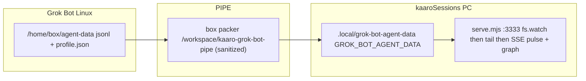

# Grok Bot PIPE

Sanitized path from Grok Bot Linux transcripts to the kaaroSessions graph on Windows.



Text flow:

```
Grok Bot Linux                    PIPE                         kaaroSessions PC
/home/box/agent-data              box packer                   .local/grok-bot-agent-data
  jsonl + profile.json    ->   /workspace/kaaro-grok-bot-pipe  ->  GROK_BOT_AGENT_DATA
                                  (sanitized)                      serve.mjs :3333
                                                                     fs.watch -> tail -> SSE pulse + graph
```

## Stages: write then pack then transport then land then watch then hear

1. **write** — Grok Bot appends JSONL under `/home/box/agent-data/agent-transcripts/<id>/<id>.jsonl` and keeps `agents/<id>/profile.json`.
2. **pack (sanitize)** — `node scripts/grok-bot-pipe.mjs box` copies only `agent-transcripts` jsonl files and `agents/*/profile.json` onto a staging dir (`/workspace/kaaro-grok-bot-pipe` by default). It never copies secrets, sqlite, WAL, or journal-mode files. Packing onto src itself is refused (must be copy mode). Each cycle writes `pipe-status.json` with side, copied/skipped/jobs, src, dest, ts, and files[] of {rel, size}.
3. **transport** — move the staging tree to the PC. See options below.
4. **land** — files end up at `D:/src/kaaroSessions/.local/grok-bot-agent-data/` (gitignored). `GROK_BOT_AGENT_DATA` points here.
5. **watch** — `serve.mjs` watches that root and tails new JSONL bytes.
6. **hear** — tail to pulse to SSE plus graph rebuild. Browser: `http://127.0.0.1:3333`. Click the graph once for AudioContext.

Secrets never cross the pipe.

## Transport options (what this project actually supports)

### 1. Default for Grok Bot agents: CopyFromBox staging files, then move

The box packer writes `/workspace/kaaro-grok-bot-pipe`. A Grok Bot (or Cursor) agent copies grown jsonl + profile.json to the PC.

CopyFromBox cannot write D:/src directly. Land under the user home (e.g. C:/Users/<you>/) then move into:

`D:/src/kaaroSessions/.local/grok-bot-agent-data/`

preserving agent-transcripts/<id>/ and agents/<id>/profile.json. Do not copy secrets or sqlite. pipe-status.json is packer metadata; leaving it in the serve root is harmless (it is not jsonl).

### 2. Optional: user mount / rsync / SMB

If the PC already has `/home/box/agent-data` (or the staging dir) mounted, set `GROK_BOT_AGENT_DATA` at that mount and skip the packer. `scripts/sync-grok-bot.mjs` then runs in **direct** mode (no copy, live jsonl tail).

### 3. Direct: serve on the Linux machine

If `serve.mjs` runs on the Linux box that holds `/home/box/agent-data`, sync is no-copy and watch tails live jsonl. The browser then needs a path to **that** serve. This Windows checkout's `127.0.0.1:3333` is **not** that process.

## How to start

On **each** side, run the init script (package script `grok-bot:init`, or `node scripts/grok-bot-pipe.mjs init`). That prints the detected side and the exact next command.

| Side | Package script | What it does |
|---|---|---|
| Linux box | `grok-bot:box` | `node scripts/grok-bot-pipe.mjs box --watch --interval=5000` — pack onto staging every 5s |
| Windows PC | `grok-bot:pc` | `node scripts/grok-bot-pipe.mjs pc --serve -- --port=3333` — mkdir `.local`, set `GROK_BOT_AGENT_DATA`, spawn `serve.mjs` |

Existing `grok-bot:sync` / `grok-bot:serve` still wrap `scripts/sync-grok-bot.mjs` (the copier the packer reuses).

CLI:

```
node scripts/grok-bot-pipe.mjs [init|box|pc] [--watch] [--once] [--interval=5000] [--src=DIR] [--dest=DIR] [--serve [-- --port=3333]]
```

Override staging with `KAARO_GROK_BOT_PIPE_STAGING` or `--dest=`. Override agent-data with `--src=` or `GROK_BOT_AGENT_DATA_SRC`.

## What is not copied

`box-secrets.json`, `host-secrets.json`, `sand-secrets.json`, `box-secrets-push-state.v1.json`, `*.db` / WAL / shm, `*.journal-mode`. The packer reuses `syncOnce` from `scripts/sync-grok-bot.mjs`.

## Skill / agent loop

Linux-side trigger playbook: `notes/skills/grok-bot-pipe.md`. Operational note: `notes/pipelines/grok-bot-pipe.md`.

